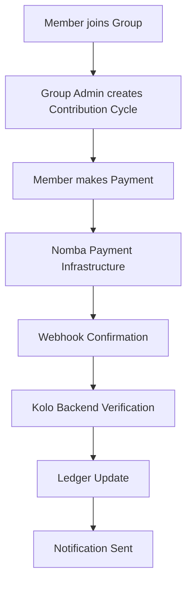
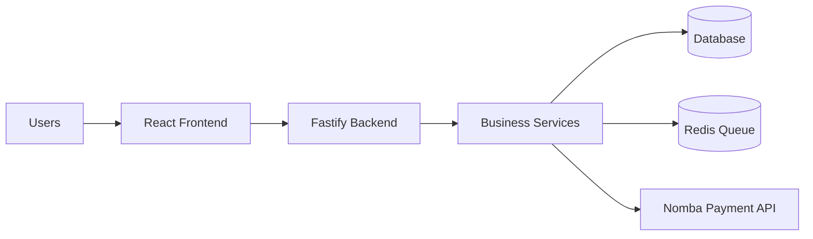

#  Kolo

<p align="center">


</p>

<h3 align="center">
Digital Infrastructure for African Cooperative Savings and Payments
</h3>

<p align="center">


</p>

---

# About Kolo

Kolo is a digital cooperative savings and payment management platform built to transform traditional African savings systems such as:

* Ajo
* Esusu
* Thrift contributions
* Cooperative savings groups

Millions of people across Africa rely on informal savings systems, but many groups still manage contributions manually using notebooks, spreadsheets, and messaging apps.

Kolo provides the financial infrastructure needed to digitize these communities with:

* Transparent contribution tracking
* Automated payments
* Digital records
* Secure payouts
* Financial analytics
* Real time notifications

Kolo connects traditional community finance with modern fintech infrastructure.

---

# The Problem

Traditional cooperative savings groups face challenges:

##  Manual Record Keeping

Many groups still track:

* Member payments
* Contribution history
* Payout schedules

using paper or spreadsheets.

##  Trust Issues

Members often lack visibility into:

* Total savings
* Payment history
* Transaction records

## Payment Difficulties

Members need simple ways to:

* Make contributions
* Receive payment confirmations
* Track balances

## Lack of Financial Insights

Group administrators cannot easily understand:

* Contribution trends
* Member performance
* Savings growth

---

# Our Solution

Kolo creates a complete digital financial ecosystem for savings communities.

## For Members

Members can:

* Join savings groups
* Pay contributions
* View payment history
* Receive notifications
* Track savings progress

## For Group Administrators

Group leaders can:

* Create groups
* Manage members
* Monitor contributions
* Approve payouts
* Generate reports

## For Platform Operators

Super administrators can:

* Manage the entire ecosystem
* Monitor transactions
* Handle compliance
* Track revenue
* Manage security

---

# Core Features

<table>

<tr>
<td>

## Cooperative Management

Create and manage Ajo groups, members, roles and contribution cycles.

</td>

<td>

## Automated Contributions

Collect payments digitally and update contribution records automatically.

</td>

</tr>

<tr>

<td>

## Payment Infrastructure

Integrated payment collection using Nomba APIs.

</td>

<td>

## Secure Payouts

Manage withdrawals and group settlements.

</td>

</tr>

<tr>

<td>

## Financial Analytics

Track savings growth, transactions and reports.

</td>

<td>

## Smart Notifications

Email and communication alerts for important events.

</td>

</tr>

</table>

---

# How Kolo Works



---

# System Architecture



---

# Technology Stack

## Frontend

Using modern frontend technologies:

* React
* TypeScript
* Vite
* Tailwind CSS
* React Router
* Axios

## Backend

Built with:

* Node.js
* Fastify
* TypeScript
* Ansofra OOP Architecture

## Database

Used for:

* Users
* Groups
* Contributions
* Transactions
* Ledger records

## Background Processing

Powered by:

* Redis
* BullMQ

Used for:

* Emails
* Notifications
* Payment processing
* Reconciliation jobs

## Payment Infrastructure

Powered by:

Nomba Payment APIs

Capabilities:

* Payment collection
* Transfers
* Virtual accounts
* Webhooks
* Transaction verification

---

# Security Approach

Financial applications require strong protection.

Kolo implements:

## API Security

* Authentication
* Role based access control
* Request validation
* Rate limiting

## Payment Security

* Server side payment verification
* Webhook validation
* Idempotent transactions

## Data Security

* Protected secrets
* Environment based configuration
* Audit logging

---

# 📁 Project Structure

```
Kolo

├── public
│
├── kolo-backend
│
├── README.md
│
├── LICENSE.md

```

---

# Documentation

| Document          | Description                           |
| ----------------- | ------------------------------------- |
| Architecture      | System design and technical decisions |
| API Documentation | Backend API reference                 |
| Security          | Security model                        |
| Deployment        | Production deployment guide           |
| Nomba Integration | Payment implementation                |
| Environment Setup | Configuration guide                   |

Documentation folder:

```

Backend documentation:

```
kolo-backend/docs/
```

---

#  Local Development

## Clone Repository

```bash
git clone repository-url
```

## Install Dependencies

Backend:

```bash
cd kolo-backend

npm install
```

Frontend:

```bash
cd frontend

npm install
```

## Configure Environment Variables

Create:

```
.env
```

Follow:

```
docs/environment.md
```

---

#  Production Deployment

Kolo supports deployment using:

* VPS servers
* Cloud servers
* Managed hosting environments

Production documentation:

```
kolo-backend/docs/deployment.md
```

---

# Why Kolo Matters

## Real African Problem

Kolo solves a real financial challenge affecting millions of cooperative communities.

## Strong Technical Implementation

The platform demonstrates:

* Payment integration
* Secure backend architecture
* Event driven processing
* Real transaction workflows

## Production Ready Thinking

Unlike simple prototypes, Kolo includes:

* Admin systems
* Security controls
* Notification infrastructure
* Payment reconciliation
* Deployment documentation

## Scalable Foundation

The architecture allows expansion into:

* SME finance
* Community banking
* Cooperative lending
* Digital wallets
* Financial inclusion products

---

# Future Roadmap

Future improvements:

* Mobile applications
* AI financial insights
* Credit scoring
* Cooperative lending
* More payment providers
* Financial education tools

---

#  Contributing

Contributions are welcome.

Please read:

```
CONTRIBUTING.md
```

---

# License

Kolo is licensed under:

```
LICENSE.md
```

---

#  Author

## Oluwayemi Oyinlola

Email:

[oluwayemioyinlola2@gmail.com](mailto:oluwayemioyinlola2@gmail.com)

Portfolio:

https://www.oyinlola.site/

---

# 🔗 Useful Resources

Icons:

* Lucide Icons
  https://lucide.dev

* Heroicons
  https://heroicons.com

* Font Awesome
  https://fontawesome.com

Animations:

* LottieFiles
  https://lottiefiles.com

---

<p align="center">

Built with ❤️ to modernize African cooperative finance.

</p>
