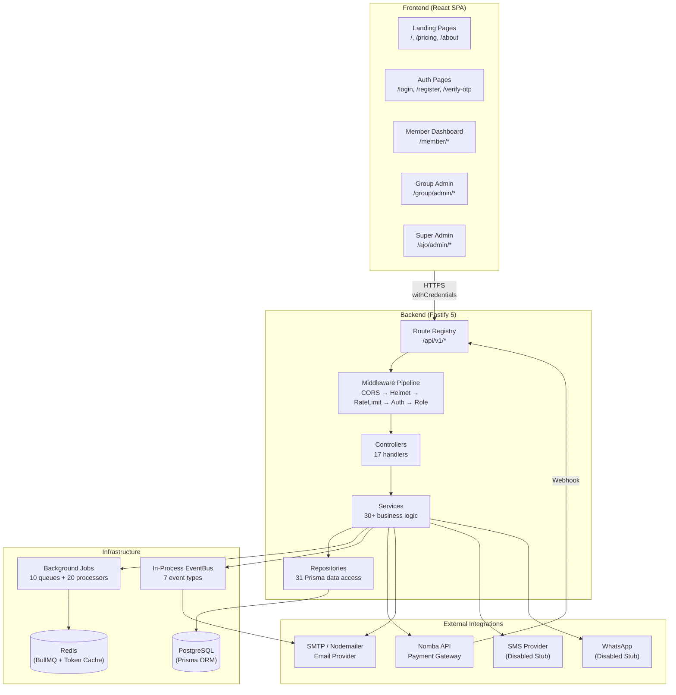
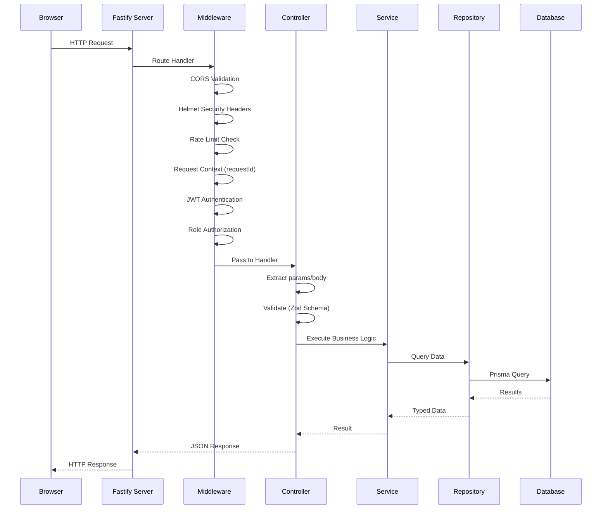
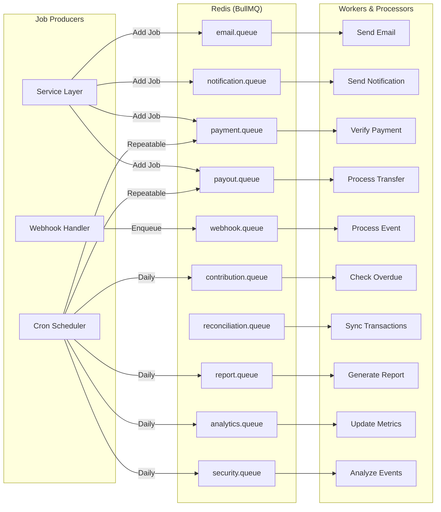
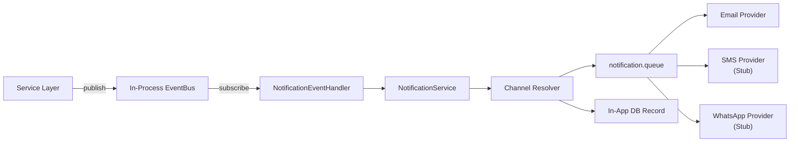

# System Architecture

This document describes the overall architecture of Kolo — from the frontend React SPA through the backend Fastify API to the database, queue infrastructure, and external service integrations.

---

## High-Level Architecture

---

## Request Lifecycle

---

## Technology Stack

| Layer | Technology | Purpose |
|---|---|---|
| **Frontend Framework** | React 18 + TypeScript | UI rendering |
| **Build Tool** | Vite 6 | Fast dev/build |
| **Styling** | Tailwind CSS 4 + shadcn/ui (Radix UI) | Design system |
| **Server State** | TanStack Query 5 | API data caching |
| **Client State** | Zustand 5 | Auth, theme, UI state |
| **Backend Framework** | Fastify 5 | High-performance HTTP server |
| **ORM** | Prisma 7 | Type-safe database access |
| **Database** | PostgreSQL 15+ | Primary data store |
| **Queue** | BullMQ 5 + Redis | Background job processing |
| **Auth** | JWT (jose) + Argon2 | Token-based authentication |
| **Payments** | Nomba API | Payment initiation, verification, transfers |
| **Email** | Nodemailer + SMTP | Transactional notifications |
| **Logging** | Pino 10 | Structured JSON logging |
| **Validation** | Zod 4 | Request/response validation |
| **HTTP Client (FE)** | Axios 1 | API communication with token refresh |

---

## Layer Responsibilities

### Routes (`routes/*.route.ts`)
- Define API endpoints with HTTP methods and paths
- Attach middleware chains (auth, role, group access)
- Bind controller handlers
- No business logic

### Middleware (`middleware/*.ts`)
1. **CORS** — Origin validation with explicit allowlist
2. **Helmet** — Security headers (CSP, HSTS, X-Frame-Options)
3. **Rate Limiter** — Global 100 req/min, per-route custom limits
4. **Request Context** — Assigns `requestId`, tracks `startTime`
5. **Auth Middleware** — Verifies JWT, loads user, checks ACTIVE status
6. **Role Middleware** — Checks `User.role` against required roles
7. **Group Middleware** — Verifies group membership and role (OWNER/ADMIN/MEMBER)

### Controllers (`controllers/*.controller.ts`)
- Extract request parameters, body, and query strings
- Validate input with Zod schemas
- Call service methods
- Return standardized JSON responses via `ResponseUtil`

### Services (`services/*.service.ts`)
- All business logic lives here
- Orchestrate repository calls, external API calls, job queueing
- Handle audit logging and event publishing

### Repositories (`repositories/*.repository.ts`)
- Pure database access via Prisma
- No business logic, no HTTP concerns

---

## Background Job Architecture

---

## Event-Driven Notification Flow

---

## Key Architectural Decisions

### 1. Clean Architecture (Ansofra Pattern)
Strict layer separation prevents controllers from accessing databases directly, ensures services contain all business logic, and keeps repositories free of business rules.

### 2. Webhook-Driven Payment Verification
Payment status is never trusted from the frontend. All confirmations arrive through HMAC-signed Nomba webhooks with duplicate event detection.

### 3. Double-Entry Accounting
Every financial transaction records matching credit and debit entries in a `LedgerEntry` table, linked through `FinancialTransaction` records.

### 4. In-Memory Access Tokens
Access tokens are stored only in JavaScript memory (module-level variable + Zustand store). On page reload, `initAuth()` silently refreshes via HttpOnly refresh cookie.

### 5. Polymorphic Wallet Ownership
The `Wallet` model uses `ownerType` + `ownerId` to support User, Group, and Platform wallets with atomic balance operations.

### 6. All Monetary Values as Integers (Kobo)
All financial values are stored as integers representing the smallest currency unit (kobo) to avoid floating-point precision issues:
- ₦10,000 = 1,000,000 kobo
- ₦500 = 50,000 kobo
