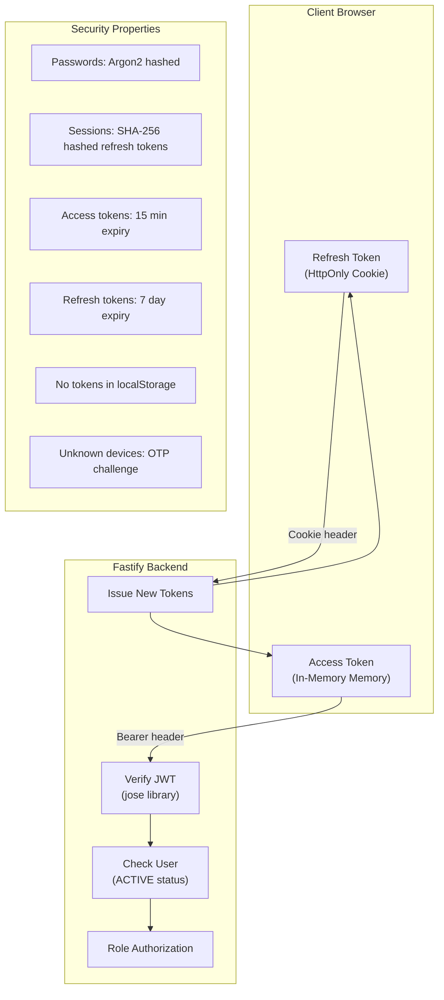
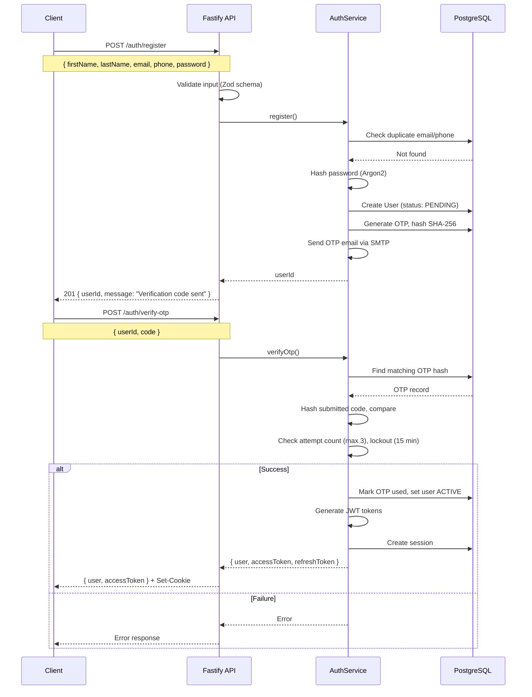
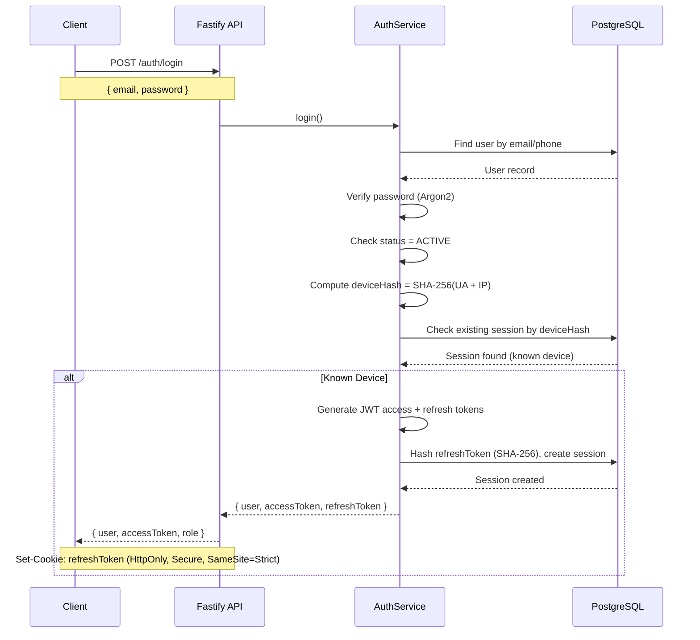
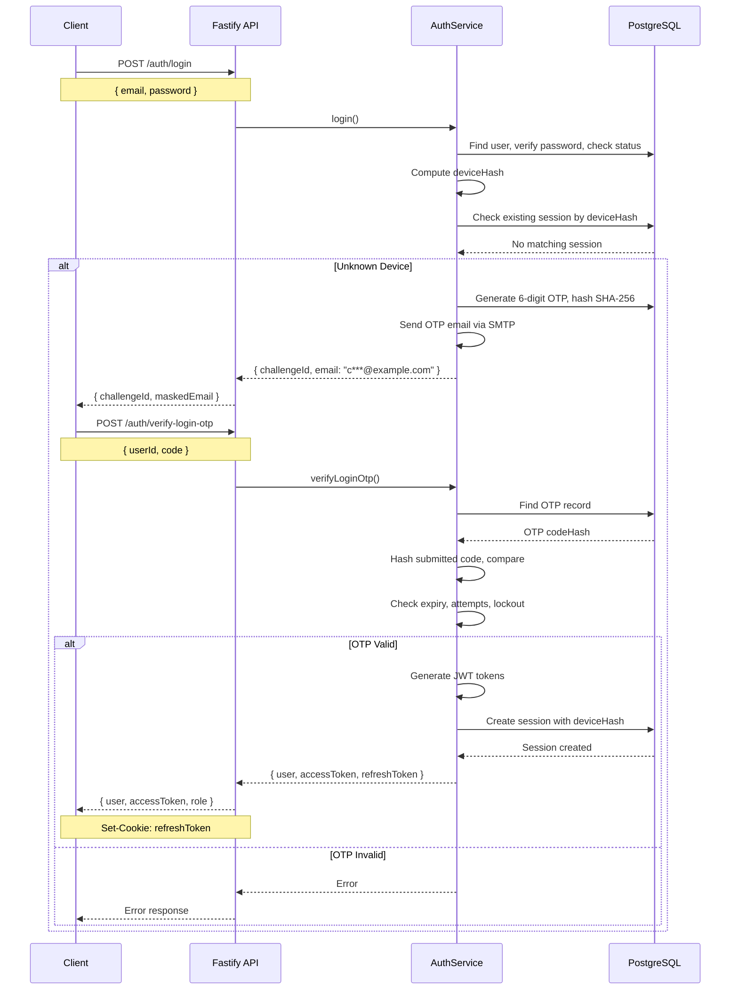
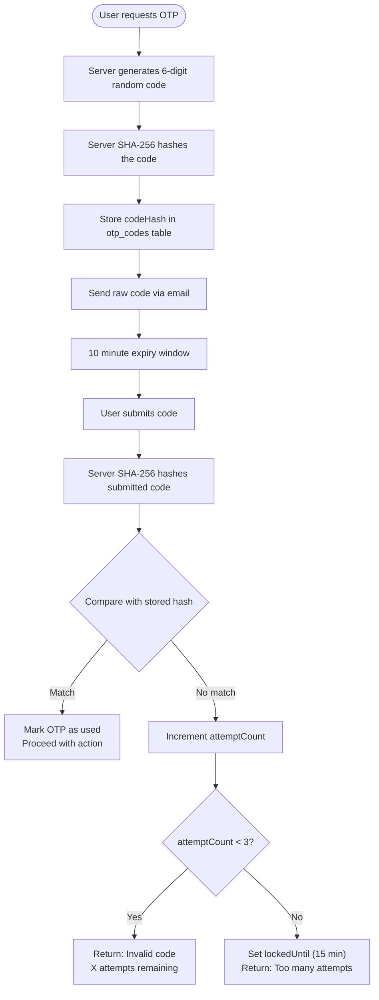

# Authentication

This document explains the complete authentication system in Kolo — from registration and login to token management, OTP verification, and role-based authorization.

---

## Authentication Overview

Kolo uses a **JWT-based authentication system** with short-lived access tokens and long-lived refresh tokens stored in HttpOnly cookies.



---

## Registration Flow



---

## Login Flows

### Known Device Login



### Unknown Device Login (OTP Challenge)



---

## Token Management

### Access Token

```json
// Decoded JWT payload
{
  "sub": "user-uuid",
  "role": "MEMBER",
  "type": "access",
  "iat": 1700000000,
  "exp": 1700000900   // 15 minutes
}
```

- Signed with `JWT_SECRET` using HS256
- Contains user ID and role
- Validated on every authenticated request
- Never stored in localStorage (kept in-memory only)

### Refresh Token

```json
// Decoded JWT payload
{
  "sub": "user-uuid",
  "type": "refresh",
  "iat": 1700000000,
  "exp": 1700604800   // 7 days
}
```

- Signed with `JWT_REFRESH_SECRET` (separate from access token secret)
- Stored as **SHA-256 hash** in the `Session` database table
- Delivered via `Set-Cookie` (HttpOnly, Secure, SameSite=Strict)
- Used only at `/auth/refresh` to obtain new access tokens

### Session Management

```
Session created at login
  ├── refreshToken: SHA-256(token)
  ├── deviceHash: SHA-256(userAgent + IP)
  └── expiresAt: now + 7 days

Session refreshed at token refresh
  ├── Old session invalidated
  └── New session created

Session deleted at logout
Session cleaned up by daily cron job (expired sessions)
```

---

## OTP System

### OTP Properties

| Property | Value |
|---|---|
| Length | 6 digits |
| Characters | 0-9 only |
| Expiry | 10 minutes |
| Max attempts | 3 (per code) |
| Lockout duration | 15 minutes (after 3 failed attempts) |
| Resend cooldown | 60 seconds |
| Storage | SHA-256 hash (raw code never persisted) |
| Delivery | Email only |

### OTP Flow



---

## Role-Based Authorization

### Platform Roles (User.role)

| Role | Privileges |
|---|---|
| `SUPER_ADMIN` | Full platform access, manage all users/groups/settings |
| `GROUP_ADMIN` | Create/manage groups, approve payouts |
| `MEMBER` | Join groups, make contributions, receive payouts |

### Group-Level Roles (GroupMember.role)

| Role | Privileges |
|---|---|
| `GROUP_OWNER` | Full group control, can delete group |
| `GROUP_ADMIN` | Manage members, approve payouts |
| `MEMBER` | Participate in group savings |

### Authorization Enforcement

```
Route → AuthMiddleware (JWT + user status)
  → RoleMiddleware (check User.role)
    → GroupMiddleware (check GroupMember.role)
      → Controller
```

**AuthMiddleware:**
```typescript
// Verifies Bearer token, loads user, checks ACTIVE status
authenticate(request, reply, done) {
  const token = extractBearerToken(request);
  const payload = JwtUtil.verifyAccessToken(token);
  const user = await userRepository.findById(payload.sub);
  if (!user || user.status !== "ACTIVE") throw new AuthError(...);
  request.userId = user.id;
  request.userRole = user.role;
}
```

**RoleMiddleware:**
```typescript
// Checks user role against allowed roles
class RoleMiddleware {
  constructor(private allowedRoles: Role[]) {}
  authorize(request, reply, done) {
    if (!this.allowedRoles.includes(request.userRole)) {
      throw new ForbiddenError("Insufficient permissions");
    }
  }
}
```

**GroupMiddleware:**
```typescript
// Checks group membership and role
requireGroupAdmin(request, reply, done) {
  const membership = await groupMemberRepository.findByGroupAndUser(groupId, userId);
  if (!membership || !["GROUP_OWNER", "GROUP_ADMIN"].includes(membership.role)) {
    throw new ForbiddenError("Group admin access required");
  }
}
```

---

## Security Headers

All API responses include security headers via Helmet:

```http
Content-Security-Policy: default-src 'self'
X-Content-Type-Options: nosniff
X-Frame-Options: DENY
Referrer-Policy: strict-origin-when-cross-origin
Strict-Transport-Security: max-age=31536000; includeSubDomains
```

---

## Rate Limiting

Auth-related rate limits:

| Endpoint | Limit | Window |
|---|---|---|
| POST /auth/register | 3 | 15 minutes |
| POST /auth/login | 5 | 1 minute |
| POST /auth/refresh | 10 | 1 minute |
| POST /auth/verify-otp | 5 | 5 minutes |
| POST /auth/resend-otp | 3 | 5 minutes |
| POST /auth/verify-login-otp | 5 | 5 minutes |

Global rate limit: 100 requests per minute per IP.

---

## Frontend Auth Implementation

### API Client Token Management

```typescript
// Access token stored in module-level variable
let currentAccessToken: string | null = null;

export function setAccessToken(token: string | null) {
  currentAccessToken = token;
}

export function getAccessToken(): string | null {
  return currentAccessToken;
}
```

### Session Restoration on Page Load

```typescript
export async function initAuth(): Promise<void> {
  try {
    // Refresh cookie sent automatically (HttpOnly)
    const refreshRes = await axios.post(`${BASE_URL}/auth/refresh`, {},
      { withCredentials: true }
    );
    const newToken = refreshRes.data.data.accessToken;
    setAccessToken(newToken);

    // Fetch user profile
    const profileRes = await axios.get(`${BASE_URL}/auth/me`, {
      headers: { Authorization: `Bearer ${newToken}` },
    });

    useAppStore.setState({
      user: profileRes.data.data,
      role: profileRes.data.data.role,
      accessToken: newToken,
      isHydrated: true,
    });
  } catch {
    useAppStore.setState({ isHydrated: true });
  }
}
```

### ProtectedRoute Component

```typescript
function ProtectedRoute({ children, allowedRoles }) {
  const accessToken = useAppStore(s => s.accessToken);
  const isHydrated = useAppStore(s => s.isHydrated);
  const role = useAppStore(s => s.role);

  if (!isHydrated) return <Loading />;
  if (!accessToken) return <Navigate to="/login" />;
  if (allowedRoles && !allowedRoles.includes(role)) {
    return <Navigate to={dashboardByRole(role)} />;
  }
  return children;
}
```
