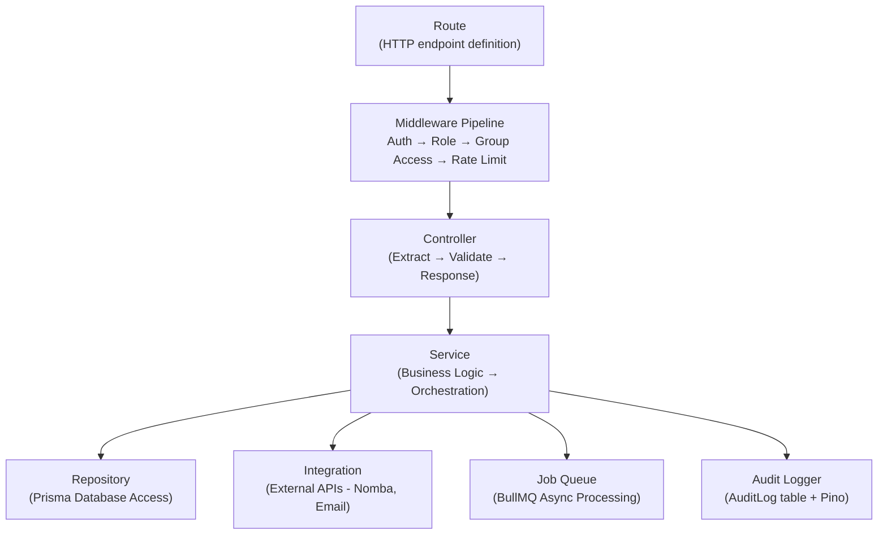
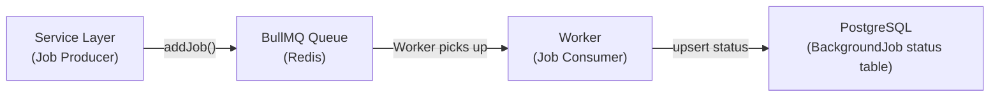
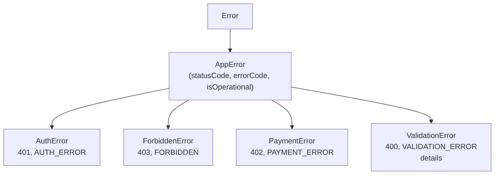
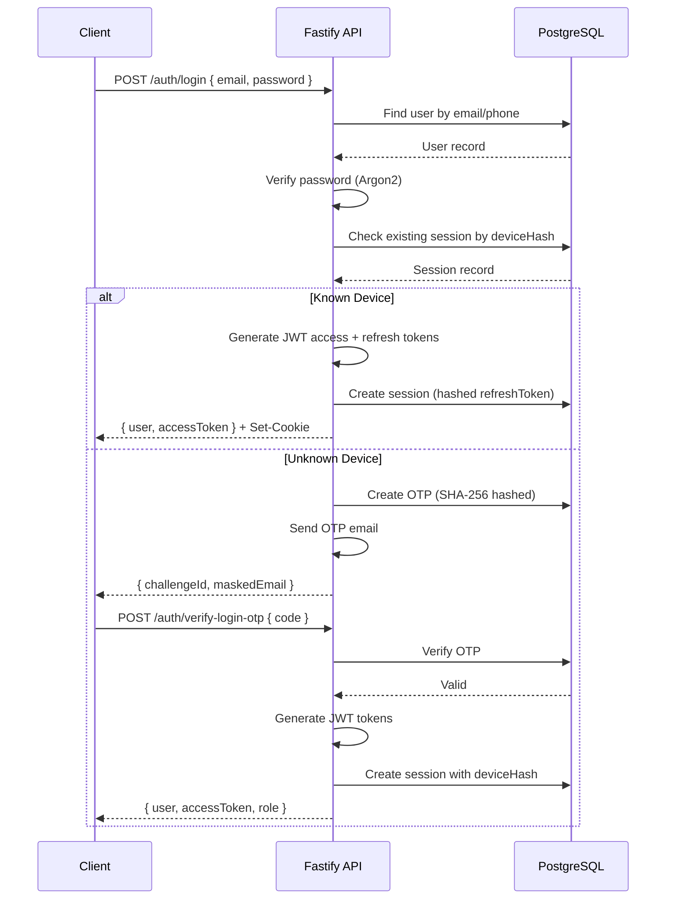
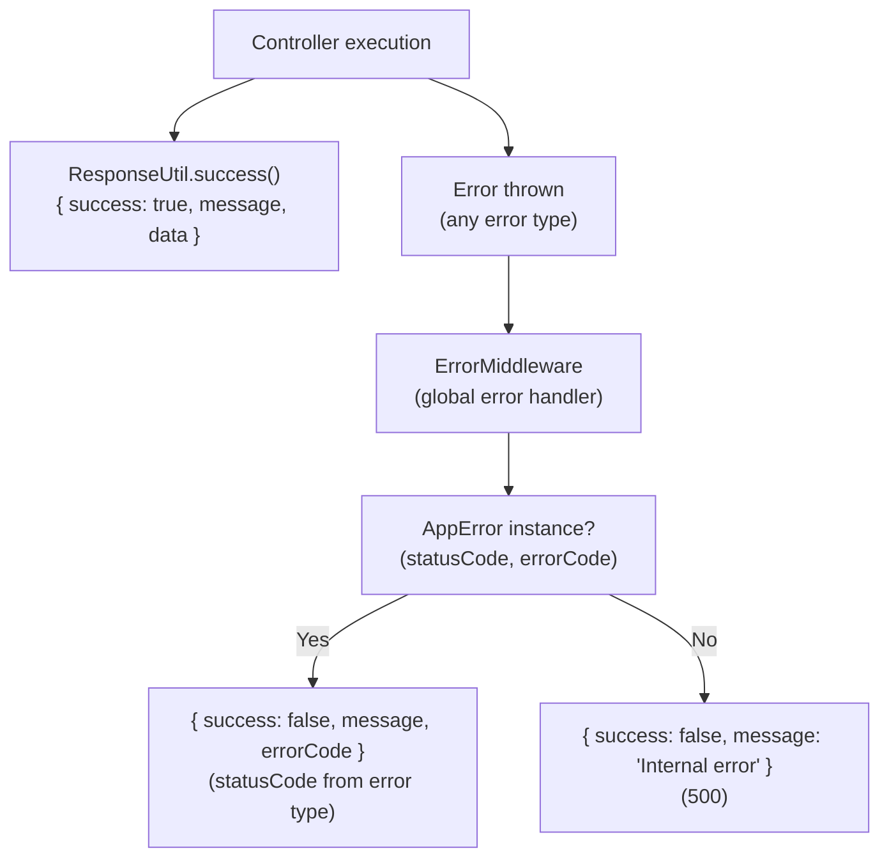

# Backend Architecture

This document describes the backend architecture of Kolo — a Fastify 5 + TypeScript + Prisma application following Clean Architecture principles.

---

## Technology Stack

| Component | Technology | Purpose |
|---|---|---|
| Framework | Fastify 5 | High-performance Node.js HTTP server |
| Language | TypeScript 5 | Type safety and developer experience |
| ORM | Prisma 7 | Database access with type-safe queries |
| Database | PostgreSQL | Primary data store |
| Queue | BullMQ 5 + Redis | Background job processing |
| Auth | JWT (jose) + Argon2 | Token-based authentication |
| Logging | Pino 10 | Structured JSON logging |

---

## Folder Structure

```
kolo-backend/
├── prisma/                    # Schema, migrations, seed
├── src/
│   ├── config/                # Env config, app config, DB config, Nomba config
│   ├── constants/             # Enums: roles, status, error codes, payment
│   ├── controllers/           # 17 HTTP request handlers
│   ├── database/              # Prisma singleton + Redis client
│   ├── dto/                   # Data transfer objects (12 files)
│   ├── errors/                # Custom error classes
│   ├── events/                # In-process EventBus + handlers
│   ├── integrations/          # External services (Nomba, SMTP, SMS, WhatsApp)
│   ├── interfaces/            # TypeScript interfaces
│   ├── jobs/                  # BullMQ queue manager, scheduler, 10 processors
│   ├── loaders/               # Bootstrap (DB, middleware, routes, jobs)
│   ├── logger/                # OOP logging (core, implementations, transports)
│   ├── middleware/             # Auth, Role, Group, Rate-limit, Error handlers
│   ├── repositories/          # 30+ data access classes
│   ├── routes/                # 17 route definitions + registry
│   ├── services/              # 30+ business logic classes
│   ├── utils/                 # Response, pagination, JWT, hash, encryption, date
│   └── validators/            # 16 Zod schemas
└── .env.example
```

---

## Architecture Layers (Request Flow)



### Route Layer (`routes/*.route.ts`)

Routes define HTTP endpoints, attach middleware, and bind controller handlers.

```typescript
app.get(`${prefix}/users/:id`, {
  preHandler: [
    this.authMiddleware.authenticate.bind(this.authMiddleware),
    this.roleMiddleware.authorize.bind(this.roleMiddleware),
  ],
  handler: this.controller.getUserById.bind(this.controller),
});
```

**Key routes:**
| File | Prefix | Endpoints |
|---|---|---|
| `auth.route.ts` | /auth | register, login, refresh, logout, verify-otp, resend-otp, verify-login-otp, me |
| `group.route.ts` | /groups | CRUD, members, invitations |
| `contribution.route.ts` | /contribution-plans | Plans, cycles, member contributions |
| `payment.route.ts` | /payments | Initiate, history, verify |
| `payout.route.ts` | /payouts | CRUD, approve, reject, process, schedules |
| `wallet.route.ts` | /wallets | Get, balance, transfer |
| `admin.route.ts` | /admin | Dashboard, users, groups, revenue, settings |
| `webhook.route.ts` | /webhooks | Nomba webhook receiver |
| `reconciliation.route.ts` | /reconciliation | List, resolve |
| `notification.route.ts` | /notifications | CRUD, preferences, deliveries |

### Middleware Layer (`middleware/*.ts`)

Middleware is executed in order before request handlers:

1. **CORS** — Origin validation with explicit allowlist
2. **Helmet** — Security headers (CSP, X-Content-Type-Options, etc.)
3. **Rate Limiter** — Global 100 req/min, per-route custom limits
4. **Request Context** — Assigns requestId, tracks startTime
5. **Auth Middleware** — Verifies JWT, loads user, checks ACTIVE status
6. **Role Middleware** — Checks user role against required roles
7. **Group Middleware** — Verifies group membership and role

### Controller Layer (`controllers/*.controller.ts`)

Controllers:
- Extract request parameters, body, and query strings
- Validate input with Zod schemas
- Call service methods
- Return standardized JSON responses via `ResponseUtil`

```typescript
async createPayout(request: FastifyRequest, reply: FastifyReply): Promise<void> {
  const { groupId } = request.params as { groupId: string };
  const parsed = createPayoutSchema.safeParse(request.body);
  if (!parsed.success) throw new ValidationError("Invalid input", parsed.error.flatten());
  const result = await this.payoutService.createPayout(parsed.data, groupId, request.userId!);
  ResponseUtil.created(reply, result, "Payout created successfully");
}
```

### Service Layer (`services/*.service.ts`)

Services contain all business logic:

- Password hashing and verification
- Token generation and validation
- Wallet operations with atomic database operations
- Payment processing and verification
- Payout approval workflows
- Notification delivery
- Fee calculation
- Audit logging

**Key services:**
| Service | Key Responsibilities |
|---|---|
| `AuthService` | Register, login, OTP, tokens, device verification |
| `PaymentService` | Initiate, verify, complete payments |
| `PayoutService` | Create, approve, process payouts |
| `WalletService` | Credit, debit, transfer with atomic operations |
| `ContributionPlanService` | Plan CRUD, cycles |
| `NotificationService` | Create, deliver notifications |
| `WebhookService` | Verify HMAC, dedup, process events |
| `OtpService` | Generate, hash, verify OTPs, rate limiting |

### Repository Layer (`repositories/*.repository.ts`)

Repositories handle all database operations via Prisma:

```typescript
class UserRepository {
  async findByEmail(email: string) {
    return this.db.user.findUnique({ where: { email } });
  }
}
```

### Integration Layer (`integrations/`)

External service integrations:
| Module | Purpose |
|---|---|
| `integrations/nomba/` | Payment gateway (client, auth, payment, transfer, virtual account, webhook) |
| `integrations/email/` | SMTP sender + template service |
| `integrations/sms/` | SMS provider stub |
| `integrations/whatsapp/` | WhatsApp provider stub |

---

## Background Jobs

Kolo uses BullMQ with Redis for async processing:



**Processors (10 total):**
| Processor | Queue | Schedule |
|---|---|---|
| `email.processor` | email.queue | On-demand |
| `notification.processor` | notification.queue | On-demand |
| `payment.processor` | payment.queue | Hourly + on-demand |
| `payout.processor` | payout.queue | Hourly + on-demand |
| `webhook.processor` | webhook.queue | On-demand |
| `contribution.processor` | contribution.queue | Daily |
| `reconciliation.processor` | reconciliation.queue | On-demand |
| `report.processor` | report.queue | Daily |
| `analytics.processor` | analytics.queue | Daily |
| `security.processor` | security.queue | Daily |

---

## Error Handling



The `ErrorMiddleware` catches all errors and returns structured JSON:
```json
{
  "success": false,
  "message": "Invalid email or password",
  "errorCode": "AUTH_ERROR",
  "statusCode": 401
}
```

---

## Data Flow Diagrams

### Payment Flow

```
Frontend                Backend                  Nomba               Database
   │                      │                       │                    │
   │── initiatePayment───▶│                       │                    │
   │                      │── createPayment ──────┼───────────────────▶│
   │                      │── initiate(Nomba) ───▶│                    │
   │◀── paymentURL ───────┤                       │                    │
   │                      │                       │                    │
   │── redirect ──────────┼──────────────────────▶│                    │
   │  (user pays)         │                       │                    │
   │                      │                       │                    │
   │                      │◀── webhook ───────────┤                    │
   │                      │   (HMAC signed)       │                    │
   │                      │                       │                    │
   │                      │── verify signature ───┤                    │
   │                      │── check duplicate ────┼───────────────────▶│
   │                      │── store event ────────┼───────────────────▶│
   │                      │── enqueue job ────────┤                    │
   │                      │                       │                    │
   │                      │── verify payment ─────▶│                    │
   │                      │◀── confirmed ─────────┤                    │
   │                      │                       │                    │
   │                      │── update payment ──────┼───────────────────▶│
   │                      │── credit wallet ──────┼───────────────────▶│
   │                      │── create ledger ──────┼───────────────────▶│
   │                      │── send notification ──┼───────────────────▶│
   │◀── realtime update ──┤                       │                    │
```

### Auth Flow



### Error Flow


