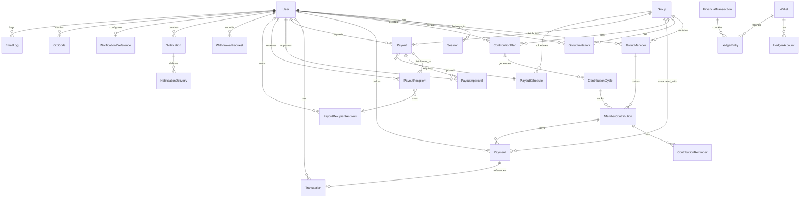

# Database Design

This document describes the database schema and architecture of Kolo — a PostgreSQL database managed through Prisma ORM.

---

## Entity Relationship Diagram



### Entity Relationships Overview

```
User
 ├── Session (refresh tokens, device tracking)
 ├── GroupMember → Group
 │                ├── ContributionPlan → ContributionCycle → MemberContribution
 │                ├── Payout → PayoutRecipient → PayoutRecipientAccount
 │                └── PayoutSchedule
 ├── Payment
 ├── Notification → NotificationDelivery
 ├── Wallet (polymorphic: USER | GROUP | PLATFORM)
 │    └── LedgerEntry → FinancialTransaction
 ├── WithdrawalRequest
 └── OtpCode
```

---

## Core Models

### User & Authentication

```
User
├── id: UUID (PK)
├── email: String (unique)
├── phone: String (unique)
├── passwordHash: String (Argon2)
├── firstName: String
├── lastName: String
├── role: Role (SUPER_ADMIN | GROUP_ADMIN | MEMBER)
├── status: UserStatus (ACTIVE | SUSPENDED | PENDING)
├── createdAt: DateTime
└── updatedAt: DateTime

Session
├── id: UUID (PK)
├── userId: UUID (FK → User)
├── refreshToken: String (SHA-256 hash, unique)
├── deviceHash: String? (SHA-256 of user-agent + IP)
├── expiresAt: DateTime
└── createdAt: DateTime
Index: [userId, deviceHash]

OtpCode
├── id: UUID (PK)
├── userId: String
├── codeHash: String (SHA-256)
├── type: String (REGISTRATION | LOGIN_CHALLENGE)
├── channel: String (EMAIL)
├── expiresAt: DateTime
├── used: Boolean
├── attemptCount: Int (default 0, max 3 → lockout)
├── lockedUntil: DateTime?
└── createdAt: DateTime
Index: [userId, type]
```

---

## Group & Membership

```
Group
├── id: UUID (PK)
├── name: String
├── description: String?
├── category: String?
├── location: String?
├── status: GroupStatus (ACTIVE | SUSPENDED | COMPLETED)
├── createdBy: UUID (FK → User)
└── timestamps

GroupMember
├── id: UUID (PK)
├── groupId: UUID (FK → Group)
├── userId: UUID (FK → User)
├── role: GroupMemberRole (GROUP_OWNER | GROUP_ADMIN | MEMBER)
├── status: GroupMemberStatus (ACTIVE | PENDING | REMOVED)
├── joinedAt: DateTime
Unique: [groupId, userId]

GroupInvitation
├── id: UUID (PK)
├── groupId: UUID (FK → Group)
├── email: String?
├── invitedBy: UUID (FK → User)
├── status: InvitationStatus (PENDING | ACCEPTED | EXPIRED | CANCELLED)
├── expiresAt: DateTime
└── timestamps
```

---

## Contribution System

```
ContributionPlan
├── id: UUID (PK)
├── groupId: UUID (FK → Group)
├── name: String
├── description: String?
├── amount: Int (kobo)
├── currency: String (NGN)
├── frequency: PlanFrequency (DAILY | WEEKLY | MONTHLY | CUSTOM)
├── startDate: DateTime
├── endDate: DateTime?
├── status: PlanStatus (ACTIVE | PAUSED | COMPLETED)
├── createdBy: UUID (FK → User)
└── timestamps

ContributionCycle
├── id: UUID (PK)
├── planId: UUID (FK → ContributionPlan)
├── cycleNumber: Int
├── periodStart: DateTime
├── periodEnd: DateTime
├── expectedAmount: Int (kobo)
├── receivedAmount: Int (kobo)
├── status: CycleStatus (OPEN | PROCESSING | COMPLETED | CANCELLED)
└── timestamps

MemberContribution
├── id: UUID (PK)
├── cycleId: UUID (FK → ContributionCycle)
├── groupMemberId: UUID (FK → GroupMember)
├── expectedAmount: Int (kobo)
├── paidAmount: Int (kobo)
├── status: ContributionStatus (PENDING | PARTIAL | PAID | LATE | MISSED)
├── paidAt: DateTime?
└── timestamps
```

---

## Payment & Transactions

```
Payment
├── id: UUID (PK)
├── userId: UUID (FK → User)
├── groupId: UUID (FK → Group)
├── contributionId: UUID? (FK → MemberContribution)
├── transactionId: UUID? (FK → Transaction, unique)
├── amount: Int (kobo)
├── currency: String (NGN)
├── provider: String (nomba)
├── providerReference: String?
├── status: PaymentStatus
│   (INITIALIZED | PENDING | SUCCESSFUL | FAILED | CANCELLED | REFUNDED)
├── paymentMethod: String?
└── timestamps
Unique: [provider, providerReference]

Transaction (high-level log)
├── id: UUID (PK)
├── reference: String (unique)
├── userId: UUID (FK → User)
├── amount: Int
├── currency: String
├── type: TransactionType (CONTRIBUTION_PAYMENT | PAYOUT | REFUND | FEE)
├── status: TransactionStatus (PENDING | SUCCESSFUL | FAILED)
├── metadata: Json?
└── timestamps

WebhookEvent
├── id: UUID (PK)
├── provider: String (nomba)
├── eventId: String?
├── eventType: String
├── payload: Json
├── signature: String?
├── status: String
├── processed: Boolean
├── processedAt: DateTime?
└── timestamps
Unique: [provider, eventId]
```

---

## Double-Entry Ledger

```
Wallet
├── id: UUID (PK)
├── ownerType: OwnerType (USER | GROUP | PLATFORM)
├── ownerId: String (polymorphic)
├── balance: Int (kobo, atomic operations)
├── currency: String (NGN)
├── status: WalletStatus (ACTIVE | FROZEN | CLOSED)
└── timestamps
Unique: [ownerType, ownerId]

LedgerEntry
├── id: UUID (PK)
├── transactionId: UUID? (FK → FinancialTransaction)
├── walletId: UUID (FK → Wallet)
├── entryType: EntryType (CREDIT | DEBIT)
├── amount: Int (kobo)
├── direction: Direction (IN | OUT)
├── balanceBefore: Int
├── balanceAfter: Int
├── description: String?
└── timestamps

FinancialTransaction
├── id: UUID (PK)
├── reference: String (unique)
├── type: FinancialTransactionType
│   (CONTRIBUTION | TRANSFER | PAYOUT | FEE | REFUND | ADJUSTMENT)
├── amount: Int (kobo)
├── currency: String (NGN)
├── status: FinancialTransactionStatus
│   (PENDING | SUCCESSFUL | FAILED | REVERSED)
├── sourceWalletId: UUID?
├── destinationWalletId: UUID?
├── metadata: Json?
└── timestamps

VirtualAccount
├── id: UUID (PK)
├── provider: String
├── providerReference: String (unique)
├── accountNumber: String (unique)
├── accountName: String
├── bankName: String
├── ownerType: OwnerType
├── ownerId: String
├── status: String
├── metadata: Json?
└── timestamps
Index: [ownerType, ownerId]
```

---

## Payout System

```
Payout
├── id: UUID (PK)
├── groupId: UUID (FK → Group)
├── requestedBy: UUID (FK → User)
├── amount: Int (kobo)
├── currency: String (NGN)
├── type: PayoutType (MANUAL | ROTATION | CUSTOM)
├── status: PayoutStatus
│   (PENDING | APPROVED | PROCESSING | SUCCESSFUL |
│    COMPLETED | FAILED | REJECTED | CANCELLED)
├── reason: String?
├── scheduleId: UUID? (FK → PayoutSchedule)
├── approvedBy: UUID? (FK → User)
├── approvedAt: DateTime?
├── processedAt: DateTime?
└── timestamps

PayoutRecipient
├── id: UUID (PK)
├── payoutId: UUID (FK → Payout)
├── userId: UUID (FK → User)
├── amount: Int (kobo)
├── destinationAccount: String?
├── recipientAccountId: UUID? (FK → PayoutRecipientAccount)
├── status: RecipientStatus
│   (PENDING | PROCESSING | SUCCESSFUL | FAILED)
├── providerReference: String?
├── transferReference: String?
├── retryCount: Int
├── failureReason: String?
└── timestamps

PayoutRecipientAccount
├── id: UUID (PK)
├── userId: UUID (FK → User)
├── bankName: String
├── accountNumber: String
├── accountName: String
├── provider: String
└── verified: Boolean (default false)
```

---

## Notification System

```
Notification
├── id: UUID (PK)
├── userId: UUID (FK → User)
├── type: NotificationType
│   (PAYMENT | CONTRIBUTION | PAYOUT | GROUP | SECURITY | SYSTEM)
├── title: String
├── message: String
├── channel: NotificationChannel (IN_APP | EMAIL | SMS | WHATSAPP)
├── status: NotificationStatus (PENDING | SENT | FAILED | READ)
├── metadata: Json?
├── readAt: DateTime?
└── timestamps

NotificationDelivery
├── id: UUID (PK)
├── notificationId: UUID (FK → Notification)
├── channel: NotificationChannel
├── status: String
├── provider: String?
├── providerReference: String?
├── attempts: Int
├── failureReason: String?
├── sentAt: DateTime?
└── createdAt: DateTime

NotificationPreference
├── id: UUID (PK)
├── userId: UUID (FK → User, unique)
├── emailEnabled: Boolean
├── smsEnabled: Boolean
├── pushEnabled: Boolean
├── whatsappEnabled: Boolean
├── securityAlerts: Boolean
├── paymentAlerts: Boolean
└── marketingMessages: Boolean
```

---

## Audit & Monitoring

```
AuditLog
├── id: UUID (PK)
├── userId: String?
├── action: String (LOGIN, PAYMENT_CREATED, PAYOUT_APPROVED, etc.)
├── ipAddress: String?
├── userAgent: String?
├── metadata: Json?
└── createdAt: DateTime

BackgroundJob
├── id: UUID (PK)
├── jobId: String
├── queue: String
├── type: String
├── status: BackgroundJobStatus (WAITING | PROCESSING | COMPLETED | FAILED)
├── progress: Int?
├── error: String?
├── payload: Json?
└── timestamps
Unique: [jobId, queue]
```

---

## Key Database Design Decisions

### 1. Monetary Values as Integers (Kobo)

All monetary values are stored as integers (in kobo) to avoid floating-point precision issues:

```
₦10,000 = 1000000 (kobo)
₦500 = 50000 (kobo)
1% fee on ₦10,000 = 10000 (kobo)
```

### 2. Atomic Wallet Operations

Balance updates use database-level atomic operations:

```sql
UPDATE wallets
SET balance = balance + amount
WHERE id = walletId AND balance >= amount  -- guard for debits
```

### 3. Double-Entry Ledger

Every financial transaction creates matching credit/debit entries:

```
Payment of ₦10,000:
  LedgerEntry 1: Wallet=Group,  Credit,  ₦9,900
  LedgerEntry 2: Wallet=Platform, Credit,   ₦100 (fee)
  LedgerEntry 3: Wallet=User,   Debit,  ₦10,000
```

### 4. Polymorphic Wallet Ownership

The `Wallet` model uses `ownerType` + `ownerId` to support polymorphic ownership (User, Group, Platform) with a unique constraint.

### 5. Soft References

Some models (OtpCode, AuditLog) use userId as a string field rather than a formal foreign key for simplicity.

### 6. Cascade Deletes

Related records are cascade-deleted:
- Group → GroupMember, ContributionPlan, Invitations, Payouts
- Notification → NotificationDelivery
- Payout → PayoutRecipient, PayoutApproval
