# Demo Guide

Kolo includes a fully offline demo system that simulates the entire platform — no backend, no database, no API keys required. Everything runs in your browser using an Axios interceptor and an in-memory data store.

---

## Demo Architecture

```mermaid
flowchart LR
    User["User visits /demo"]
    DemoPage["Demo Page\nRole selection → Login → OTP"]
    Login["Login flow\nPassword: Demo@1234\nOTP: 000000"]
    SetToken["setAccessToken('demo-token-...')\nsetActiveDemoUser(userId)"]
    Axios["Axios Request Interceptor\ndetects demo-token- prefix"]
    DemoAdapter["Demo Adapter\nroutes request to local handler"]
    DemoStore["Demo Store\nIn-memory database\nlocalStorage persistence"]
    Dashboard["Protected Dashboard\nRenders normally with mock data"]

    User --> DemoPage
    DemoPage --> Login
    Login --> SetToken
    SetToken --> Dashboard
    Dashboard -->|API call| Axios
    Axios -->|short-circuit| DemoAdapter
    DemoAdapter --> DemoStore
```

### How It Works

1. **Login**: Select a role on `/demo`, enter password `Demo@1234`, enter OTP `000000`
2. **Token**: The app calls `setAccessToken('demo-token-...')` which stores the token in a module-level variable
3. **Interceptor**: Axios request interceptor checks if `currentAccessToken` starts with `demo-token-`. If so, it short-circuits the request and routes it to `handleDemoRequest()`
4. **Mock Data**: The demo adapter parses the HTTP method + URL and returns appropriate mock data from the in-memory store
5. **Persistence**: Demo data is persisted in localStorage and survives page refreshes. A "Reset data" button restores initial state.

### Key Files

| File | Purpose |
|---|---|
| `src/features/demo/pages/demo.page.tsx` | Role selection, login form, OTP verification |
| `src/features/demo/pages/demo-checkout.page.tsx` | Simulated Nomba checkout with card selection |
| `src/features/demo/components/DashboardGallery.tsx` | Screenshot preview gallery with lightbox |
| `src/features/demo/data/demo-data.ts` | Seed users, OTP codes, payment cards |
| `src/features/demo/store/demo-store.ts` | In-memory mock database with CRUD operations |
| `src/features/demo/api/demo-adapter.ts` | Axios interceptor handler that routes requests |
| `src/api/client.ts` | Axios client with demo mode interceptor |

---

## Demo Users

| Role | Name | Email | Password | OTP |
|---|---|---|---|---|
| **Platform Admin** | Oluwayemi Oyinlola | admin@kolo.demo | `Demo@1234` | `000000` |
| **Group Admin** | Chioma Eze | chioma@kolo.demo | `Demo@1234` | `000000` |
| **Member** | Adaobi Okonkwo | ada@kolo.demo | `Demo@1234` | `000000` |

All users share the same password and OTP. The demo login flow has two steps:

1. **Password step**: Enter `Demo@1234` (any other password shows an error)
2. **OTP step**: Enter a 6-digit code from the OTP reference table

### OTP Codes Reference

| Code | Result | Description |
|---|---|---|
| `000000` | Success | Successful verification — logs you in |
| `111111` | Wrong | Shows "Invalid verification code" error |
| `222222` | Expired | Shows "Code has expired" error |

---

## Walkthrough

### 1. Visit the Demo Page

Navigate to `/demo`. The landing page shows:

- **Hero section**: "Try Kolo Without Signing Up"
- **3 role cards**: Platform Admin, Group Admin, Member — each showing the email and password hint
- **Test Payment Cards**: 3 virtual Verve cards showing different payment outcomes
- **OTP Codes Reference**: Grid of sample OTP codes with their outcomes
- **Dashboard Previews**: Tabbed gallery with 27 screenshots across all roles
- **Demo metadata**: Info about data staying in browser, zero backend, works offline

### 2. Select a Role

Click **"Continue as [Role]"** on any card. The login form appears with the email pre-filled.

### 3. Log In

- Password is pre-hinted: `Demo@1234`
- Click **"Sign In"** — a 600ms simulated delay adds realism
- On success, you're taken to the OTP verification screen

### 4. Verify OTP

- Enter `000000` for successful verification
- The 6 input fields auto-advance as you type
- Click **"Verify Code"** — 800ms simulated delay
- On success, you're redirected to the role's dashboard

### 5. Explore the Dashboard

Each dashboard is fully functional with mock data:

#### Platform Admin (`/ajo/admin/*`)
13 pages: Dashboard, Users, Groups, Transactions, Payments, Withdrawals, Revenue, Disputes, Verification, Notifications, Security, System Settings, Audit Logs

#### Group Admin (`/group/admin/*`)
9 pages: Dashboard, Members, Contributions, Transactions, Payouts, Reports, Payments Analytics, Notifications, Settings

#### Member (`/member/*`)
5 pages: Home, Groups, History, Notifications, Profile

### 6. Make a Payment (Demo Checkout)

From the Member dashboard, click **"Pay Now"** on a pending contribution:

1. Select **"Debit / Credit Card"** as payment method
2. Click **"Pay ₦X Now"**
3. The payment initiates and you're redirected to the demo checkout page (`/demo/checkout`)
4. Choose a test card from the dropdown (or use the default)
5. Click **"Pay Now"** — 2-second processing delay
6. Enter OTP — use the code matching your chosen card:
   - Card "ending in 7890" + OTP `000000` → **Success**
   - Card "ending in 7891" + OTP `111111` → **Wrong OTP error**
   - Card "ending in 7892" + OTP `222222` → **Expired OTP error**
7. On success, click **"Continue"** to return to the member dashboard

---

## Test Payment Cards

| Card | Number | OTP | Outcome |
|---|---|---|---|
| **Success** (green) | 4084 0812 3456 7890 | `000000` | Payment succeeds |
| **Wrong** (red) | 4084 0812 3456 7891 | `111111` | "Invalid OTP" error |
| **Expired** (amber) | 4084 0812 3456 7892 | `222222` | "OTP expired" error |

All cards are Verve network with CVV `123`/`456`/`789` and expiry `12/27`.

---

## Dashboard Previews Gallery

The demo page includes a tabbed gallery showing 27 real screenshots of every dashboard page. Use the **Platform Admin / Group Admin / Member** tabs to switch between roles, and the left/right arrows or dot indicators to browse screenshots. Click any screenshot to open a full-size lightbox preview.

---

## Demo vs Production

| Aspect | Demo Mode | Production Mode |
|---|---|---|
| Backend | None — all in-browser | Fastify 5 + PostgreSQL + Redis |
| Payments | Simulated OTP flow | Real Nomba payment gateway |
| Data | localStorage (ephemeral) | PostgreSQL (persistent) |
| Auth | Demo token (in-memory) | JWT + refresh cookies |
| OTP | `000000` / `111111` / `222222` | Real 6-digit SMS/email OTP |
| Webhooks | Not simulated | HMAC-signed Nomba webhooks |
| Email | Not sent | Real SMTP delivery |
| Reset | "Reset data" button restores seed | N/A — real data |
| Screenshots | 27 preview images in gallery | Not applicable |

---

## Limitation: Auth Persistence

The demo token is stored in a JavaScript module variable (`currentAccessToken` in `client.ts`), not in localStorage. This means:

- **SPA navigation** preserves auth (clicking sidebar links, navigating via `navigate()`)
- **Full page reload** (`window.location.href`, browser refresh) **loses auth** and redirects to `/login`

The payment flow accounts for this: when in demo mode, the checkout redirect uses SPA navigation (`navigate()`) instead of `window.location.href` to preserve the auth state. If you reach `/demo/checkout` via direct URL, the "Continue" button after payment falls back to `/demo` instead of the protected `/member/pay-success` page.
