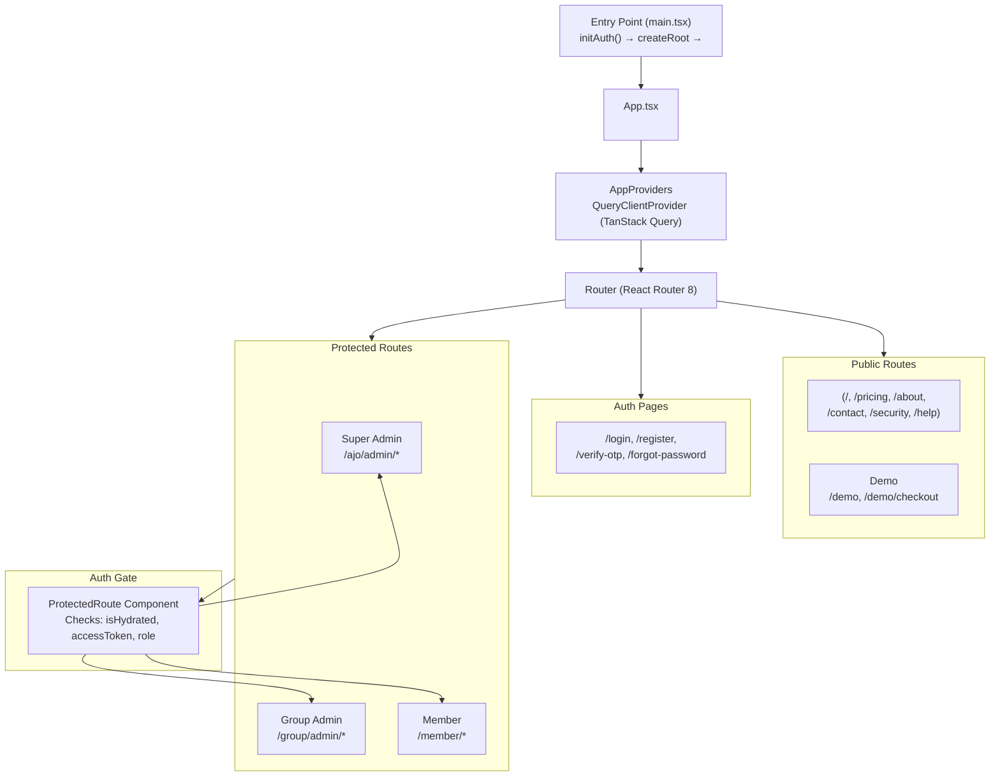
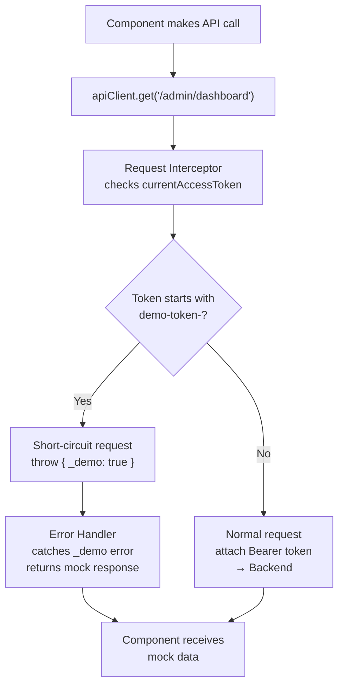
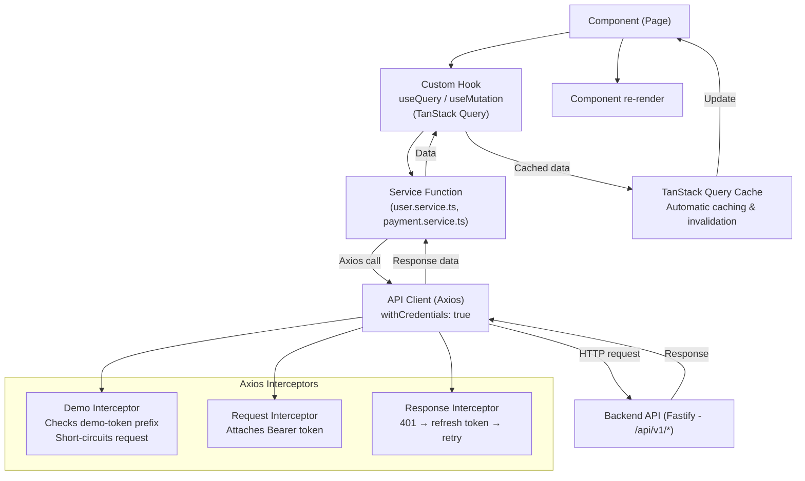
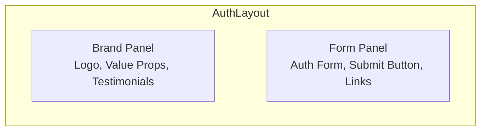
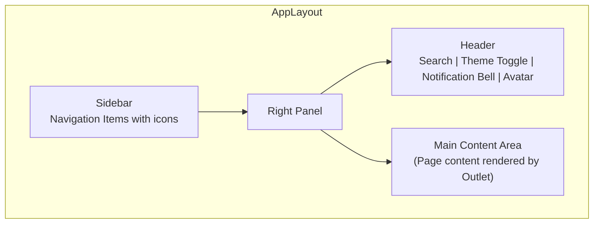
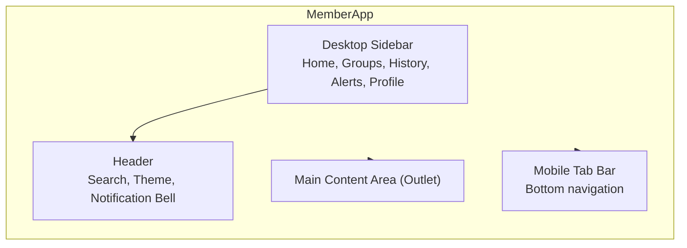
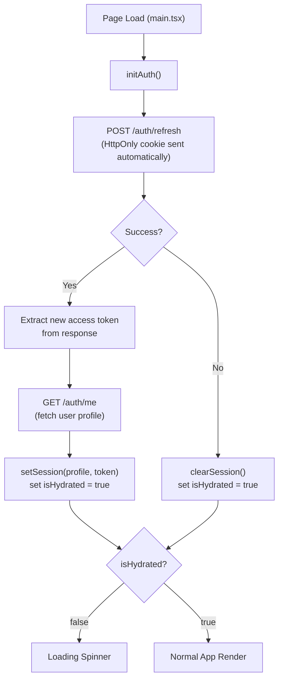

# Frontend Architecture

This document describes the frontend architecture of Kolo — a React 19 + TypeScript + Vite SPA built with feature-based organization.

---

## Technology Stack

| Component | Technology | Purpose |
|---|---|---|
| Framework | React 19 | UI rendering |
| Language | TypeScript 6 | Type safety |
| Build Tool | Vite 8 | Fast dev server and builds |
| Styling | Tailwind CSS 4 + Radix UI | Design system |
| Server State | TanStack Query 5 | API data caching and mutation |
| Client State | Zustand 5 | Auth, theme, global UI state |
| Routing | React Router 8 | SPA routing |
| Forms | React Hook Form + Zod | Form validation |
| HTTP | Axios 1 | API communication |
| Icons | Lucide React | UI icons |
| Charts | Recharts | Data visualization |
| Notifications | Sonner | Toast notifications |

---

## Folder Structure

```
kolo-frontend/
├── public/                        # Static assets, demo screenshots
├── scripts/                       # Playwright screenshot script
├── src/
│   ├── api/                       # Axios client with auth + demo interceptors
│   ├── app/                       # App shell, providers, router, Zustand store
│   ├── assets/                    # Static assets
│   ├── components/                # Shared UI components
│   │   ├── ui/                    # shadcn/ui primitives (26 Radix packages)
│   │   ├── shared/                # App-specific shared components
│   │   └── layout/                # Layout shells (AppLayout, AuthLayout, MemberApp)
│   ├── features/                  # Feature-based modules
│   │   ├── auth/                  # Login, register, OTP, password reset
│   │   ├── landing/               # Public marketing pages (10 pages)
│   │   ├── admin/                 # Super Admin dashboard (14 pages)
│   │   ├── group/                 # Group Admin dashboard (11 pages)
│   │   ├── member/                # Member dashboard (11 pages)
│   │   ├── demo/                  # Offline demo system
│   │   │   ├── api/               # Demo adapter (Axios interceptor handler)
│   │   │   ├── components/        # Demo-specific components (DashboardGallery)
│   │   │   ├── data/              # Seed data (users, OTP codes, payment cards)
│   │   │   ├── pages/             # Demo login page + checkout simulation
│   │   │   └── store/             # In-memory mock database with localStorage
│   │   ├── contribution/          # Contribution hooks/services
│   │   ├── cooperative/           # Cooperative hooks/services
│   │   ├── dashboard/             # Dashboard hooks/services
│   │   ├── notification/          # Notification hooks/services
│   │   └── payment/               # Payment hooks/services
│   ├── hooks/                     # TanStack Query hooks (28 files)
│   ├── services/                  # API service functions (20 files)
│   ├── styles/                    # CSS: tailwind, theme, fonts, globals
│   ├── types/                     # TypeScript type definitions
│   └── utils/                     # Formatting, CSV, error, env utilities
└── index.html                     # SPA shell
```

---

## Application Architecture



---

## Demo Mode Architecture

Kolo includes a fully offline demo system that requires no backend. It works through the Axios request interceptor:



### Demo Flow

1. User logs in at `/demo` with password `Demo@1234` + OTP `000000`
2. `setAccessToken('demo-token-demo-user-1234567890')` stores the token in memory
3. `setActiveDemoUser('demo-member')` sets the active user in the demo store
4. `setSession(user, token)` updates the Zustand store (sets `isAuthenticated: true`)
5. All subsequent API calls are intercepted — `handleDemoRequest()` parses the method + URL and returns appropriate mock data
6. The demo store is an in-memory mock database (`Map`-based collections) with localStorage persistence

### Key Files

| File | Role |
|---|---|
| `src/api/client.ts` | Axios instance with demo interceptor (lines 40-62) |
| `src/features/demo/api/demo-adapter.ts` | Routes mock requests to store functions |
| `src/features/demo/store/demo-store.ts` | In-memory store with 20+ mock data functions |
| `src/features/demo/data/demo-data.ts` | Seed data (3 users, 3 OTP codes, 3 payment cards) |
| `src/features/demo/pages/demo.page.tsx` | Login UI (role cards, password, OTP, gallery) |
| `src/features/demo/pages/demo-checkout.page.tsx` | Simulated Nomba checkout |
| `src/features/demo/components/DashboardGallery.tsx` | 27-screenshot preview with lightbox |

---

## Data Flow



### The API Client

```typescript
// api/client.ts
const apiClient = axios.create({
  baseURL: VITE_API_URL,
  withCredentials: true,  // Sends HttpOnly cookies
});

// Demo interceptor — runs first to short-circuit requests with mock data
apiClient.interceptors.request.use((config) => {
  if (currentAccessToken?.startsWith("demo-token-")) {
    const response = handleDemoRequest(config);
    if (response) {
      (config as any)._demoResponse = response;
      throw { _demo: true, config };
    }
  }
  return config;
});

// Response interceptor — catches the demo short-circuit and returns mock data
apiClient.interceptors.response.use(
  (response) => response,
  (error: any) => {
    if (error._demo) {
      return error.config._demoResponse;
    }
    throw error;
  },
);

// Token interceptor — attaches Bearer token for production requests
apiClient.interceptors.request.use((config) => {
  if (currentAccessToken) {
    config.headers.Authorization = `Bearer ${currentAccessToken}`;
  }
  return config;
});
```

---

## State Management

### Layer 1: TanStack Query (Server State)

All API data is cached by TanStack Query with automatic invalidation:

```typescript
// hooks/use-payments.ts
export function usePayments() {
  return useQuery({
    queryKey: ["payments"],
    queryFn: () => paymentService.getPaymentHistory(),
  });
}
```

28 query hooks cover: analytics, audit logs, auth, contributions, cooperatives, disputes, group members, KYC, notifications, payment analytics, payment config, payments, payouts, profile, real-time, receipts, transactions, users, virtual accounts, withdrawals.

### Layer 2: Zustand (Client State)

Global client state for auth, theme, and UI:

```typescript
// app/store.ts
interface AppState {
  user: AuthUser | null;
  role: UserRole | null;
  accessToken: string | null;
  isHydrated: boolean;
  theme: ThemeMode;
  setSession: (user: AuthUser, accessToken: string) => void;
  clearSession: () => void;
  setTheme: (theme: ThemeMode) => void;
  toggleTheme: () => void;
}
```

---

## Routing & Protected Routes

### Route Groups

| Group | Routes | Access |
|---|---|---|
| Public | `/`, `/pricing`, `/about`, `/contact`, etc. | Everyone |
| Demo | `/demo`, `/demo/checkout` | Everyone (no auth required) |
| Auth | `/login`, `/register`, `/verify-otp` | Unauthenticated |
| Super Admin | `/ajo/admin/*` | `SUPER_ADMIN` |
| Group Admin | `/group/admin/*` | `GROUP_ADMIN`, `GROUP_OWNER` |
| Member | `/member/*` | `MEMBER`, `GROUP_ADMIN`, `SUPER_ADMIN` |

### ProtectedRoute Component

```typescript
function ProtectedRoute({ children, allowedRoles }) {
  const isHydrated = useAppStore(s => s.isHydrated);
  const accessToken = useAppStore(s => s.accessToken);
  const role = useAppStore(s => s.role);

  if (!isHydrated) return <Loading />;
  if (!accessToken) return <Navigate to="/login" />;
  if (allowedRoles && !allowedRoles.includes(role)) {
    return <Navigate to={roleBasedDashboard(role)} />;
  }
  return children;
}
```

### Demo Route Note

`/demo` and `/demo/checkout` are NOT wrapped in `ProtectedRoute` — they are public pages. The demo login sets auth state in the Zustand store, allowing subsequent navigation to protected routes. However, the auth token (`currentAccessToken`) is stored in a JavaScript module variable, meaning **full page reloads will lose the auth state** and redirect to `/login`. See `docs/demo-guide.md` for details.

---

## Theming System

Kolo uses a CSS custom property-based theming system with Tailwind CSS 4:

```css
/* Light mode */
:root {
  --primary: #065f46;
  --background: #ffffff;
  --card: #ffffff;
}

/* Dark mode */
.dark {
  --primary: #10b981;
  --background: #0a0f0d;
  --card: #111918;
}
```

Theme is toggled by adding/removing the `dark` class on `<html>` and persisted in localStorage via `kolo.theme`.

---

## Layout Components

### AuthLayout (Login/Register pages)


### AppLayout (Admin Dashboards)


### MemberApp (Mobile-first)


---

## InitAuth Flow

On page load, `initAuth()` attempts to restore the session:



When no refresh token cookie is available (fresh visit or demo mode), `initAuth()` catches the error and sets `isHydrated: true` with null user. For demo mode, the login flow at `/demo` calls `setSession()` directly with the demo user and token.
