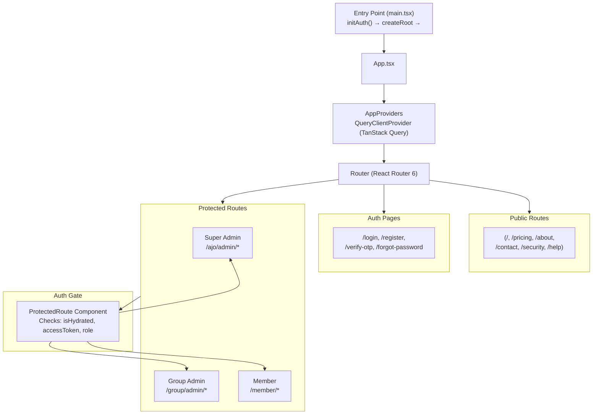
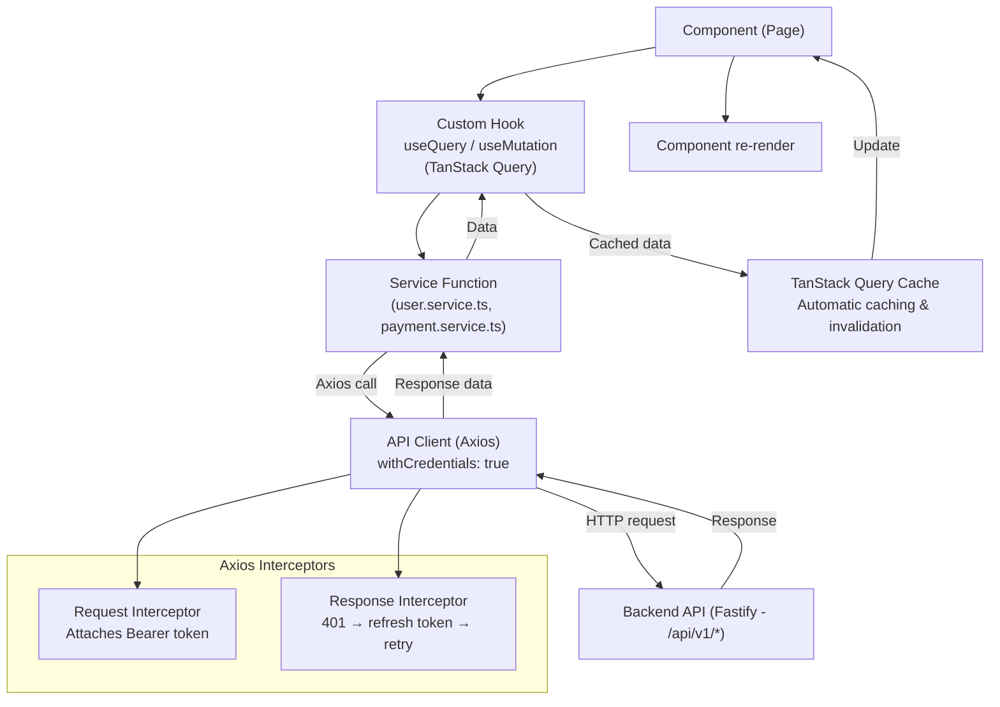
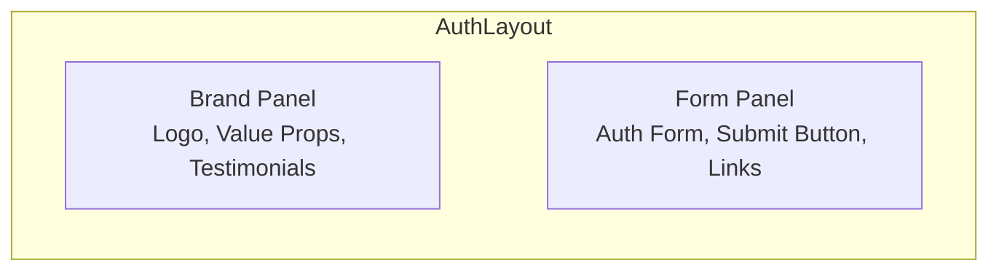
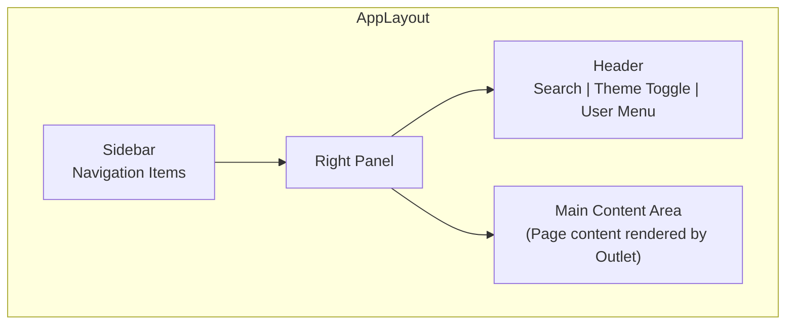
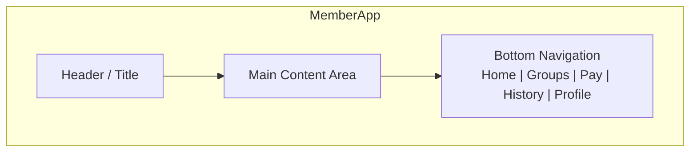
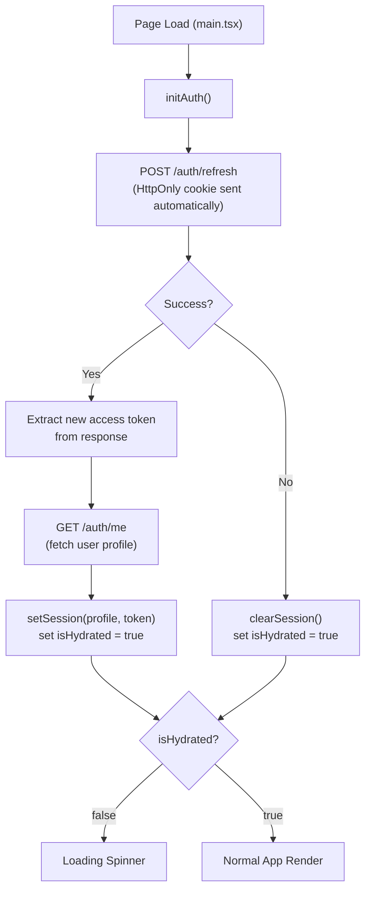

# Frontend Architecture

This document describes the frontend architecture of Kolo — a React 18 + TypeScript + Vite SPA built with feature-based organization.

---

## Technology Stack

| Component | Technology | Purpose |
|---|---|---|
| Framework | React 18.3 | UI rendering |
| Language | TypeScript 5 | Type safety |
| Build Tool | Vite 6 | Fast dev server and builds |
| Styling | Tailwind CSS 4 + Radix UI | Design system |
| Server State | TanStack Query 5 | API data caching and mutation |
| Client State | Zustand 5 | Auth, theme, global UI state |
| Routing | React Router 6 | SPA routing |
| Forms | React Hook Form + Zod 4 | Form validation |
| HTTP | Axios 1 | API communication |
| Icons | Lucide React + MUI Icons | UI icons |
| Charts | Recharts | Data visualization |

---

## Folder Structure

```
public/
├── src/
│   ├── app/               # App shell, providers, router, store
│   ├── api/               # Axios client with auth interceptor
│   ├── assets/            # Static assets
│   ├── components/        # Shared UI components
│   │   ├── ui/            # shadcn/ui primitives (48 components)
│   │   ├── shared/        # App-specific shared components
│   │   └── layout/        # Layout shells (AppLayout, AuthLayout)
│   ├── constants/         # Route constants
│   ├── features/          # Feature-based modules
│   │   ├── auth/          # Login, register, OTP, password reset
│   │   ├── landing/       # Public marketing pages
│   │   ├── admin/         # Super Admin dashboard (13 pages)
│   │   ├── group/         # Group Admin dashboard (10 pages)
│   │   ├── member/        # Member dashboard (9 pages)
│   │   └── ...            # Other features
│   ├── hooks/             # TanStack Query hooks (15 files)
│   ├── services/          # API service functions (13 files)
│   ├── styles/            # CSS: tailwind, theme, fonts, globals
│   ├── types/             # TypeScript type definitions
│   └── utils/             # Utility functions
└── index.html             # SPA shell
```

---

## Application Architecture



---

## Data Flow



### The API Client

```typescript
// api/client.ts
const apiClient = axios.create({
  baseURL: VITE_API_URL,
  withCredentials: true,  // Sends HttpOnly cookies
});

// Request interceptor: attaches access token
apiClient.interceptors.request.use((config) => {
  const token = getAccessToken();
  if (token) config.headers.Authorization = `Bearer ${token}`;
  return config;
});

// Response interceptor: handles token refresh
apiClient.interceptors.response.use(
  (response) => response,
  async (error) => {
    if (error.response?.status === 401 && !error.config._retry) {
      // Queue request, attempt refresh, retry
      const newToken = await refreshAccessToken();
      error.config.headers.Authorization = `Bearer ${newToken}`;
      return apiClient(error.config);
    }
    return Promise.reject(error);
  }
);
```

---

## State Management

### Layer 1: TanStack Query (Server State)

All API data is cached by TanStack Query with automatic invalidation:

```typescript
// hooks/use-payments.ts
export function usePayments() {
  return useQuery({
    queryKey: ["payments"],
    queryFn: () => paymentService.getPaymentHistory(),
  });
}

export function useInitiatePayment() {
  const queryClient = useQueryClient();
  return useMutation({
    mutationFn: (data: PaymentDto) => paymentService.initiatePayment(data),
    onSuccess: () => queryClient.invalidateQueries({ queryKey: ["payments"] }),
  });
}
```

### Layer 2: Zustand (Client State)

Global client state for auth, theme, and UI:

```typescript
// app/store.ts
interface AppState {
  user: AuthUser | null;
  role: UserRole | null;
  accessToken: string | null;
  isHydrated: boolean;
  theme: ThemeMode;
  setSession: (user: AuthUser, accessToken: string) => void;
  clearSession: () => void;
}
```

---

## Routing & Protected Routes

### Route Groups

| Group | Routes | Access |
|---|---|---|
| Public | `/`, `/pricing`, `/about`, `/contact`, etc. | Everyone |
| Auth | `/login`, `/register`, `/verify-otp` | Unauthenticated |
| Super Admin | `/ajo/admin/*` | `SUPER_ADMIN` |
| Group Admin | `/group/admin/*` | `GROUP_ADMIN`, `GROUP_OWNER` |
| Member | `/member/*` | `MEMBER`, `GROUP_ADMIN`, `SUPER_ADMIN` |

### ProtectedRoute Component

```typescript
function ProtectedRoute({ children, allowedRoles }) {
  const isHydrated = useAppStore(s => s.isHydrated);
  const accessToken = useAppStore(s => s.accessToken);
  const role = useAppStore(s => s.role);

  if (!isHydrated) return <Loading />;
  if (!accessToken) return <Navigate to="/login" />;
  if (allowedRoles && !allowedRoles.includes(role)) {
    return <Navigate to={roleBasedDashboard(role)} />;
  }
  return children;
}
```

---

## Theming System

Kolo uses a CSS custom property-based theming system:

```css
/* Light mode */
:root {
  --primary: #065f46;
  --background: #ffffff;
  --card: #ffffff;
}

/* Dark mode */
.dark {
  --primary: #10b981;
  --background: #0a0f0d;
  --card: #111918;
}
```

Theme is toggled by adding/removing the `dark` class on `<html>` and persisted in localStorage.

---

## Layout Components

### AuthLayout (Login/Register pages)


### AppLayout (Admin Dashboards)


### MemberApp (Mobile-first)


---

## InitAuth Flow

On page load, `initAuth()` attempts to restore the session:


