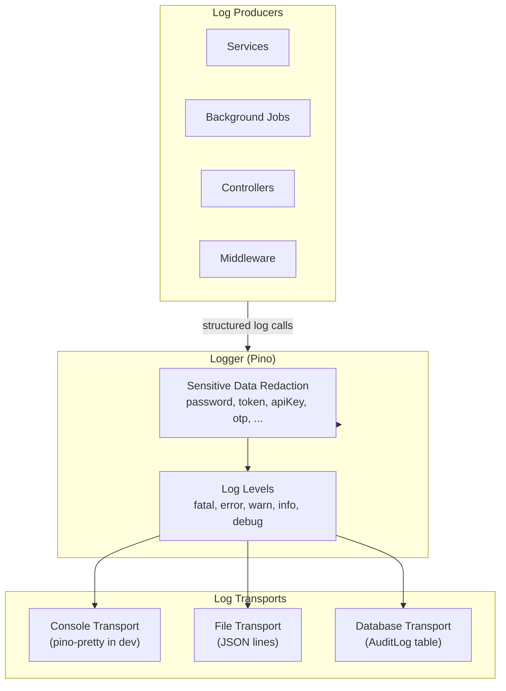
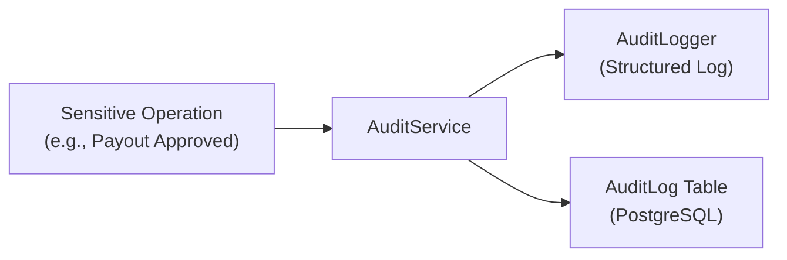

# Monitoring

This document describes the monitoring, logging, health checking, error tracking, and performance monitoring systems in Kolo.

---

## Logging Architecture

Kolo uses a structured JSON logging framework built on **Pino** — one of the fastest Node.js loggers.



### Log Levels

| Level | Usage | Example |
|---|---|---|
| `fatal` | System is unusable | Database connection failed |
| `error` | Operation failed | Payment verification failed |
| `warn` | Unexpected but handled | Rate limit exceeded |
| `info` | Normal operations | User logged in, payment created |
| `debug` | Detailed debugging | Request payloads |

### Domain-Specific Loggers

```typescript
// Each domain gets its own logger with context
const paymentLogger = new PaymentLogger();
paymentLogger.info("Payment initiated", { paymentId, amount });

const securityLogger = new SecurityLogger();
securityLogger.warn("Unknown device login attempt", { userId, ip });

const auditLogger = new AuditLogger();
auditLogger.log("PAYOUT_APPROVED", { payoutId, approvedBy: userId });
```

### Sensitive Data Redaction

Sensitive fields are automatically redacted before logging:

```typescript
const SENSITIVE_KEYS = [
  "password", "passwordHash", "token", "accessToken", "refreshToken",
  "secret", "apiKey", "apiSecret", "authorization", "cookie",
  "verificationCode", "otp", "code", "pin", "bankAccount",
];
```

---

## Health Checks

### Endpoint

```
GET /api/v1/health
```

**Response (healthy):**
```json
{
  "status": "ok",
  "timestamp": "2026-06-27T12:00:00.000Z"
}
```

**Response (unhealthy):**
```json
{
  "status": "error",
  "timestamp": "2026-06-27T12:00:00.000Z",
  "error": "Database connection failed"
}
```

### Monitoring Configuration

Configure your monitoring tool (e.g., UptimeRobot, Pingdom, Better Uptime) to check the health endpoint every 30-60 seconds.

**Alert conditions:**
- 2 consecutive failures → Notify on-call
- 5 consecutive failures → Escalate
- Response time > 5s → Performance alert

---

## Background Job Monitoring

Kolo uses BullMQ with Redis for async processing. Jobs are tracked in the database:

```
BackgroundJob table:
  ├── jobId: Unique identifier
  ├── queue: Queue name (email, payment, payout, etc.)
  ├── type: Job type
  ├── status: (WAITING | PROCESSING | COMPLETED | FAILED)
  ├── progress: Percentage complete
  ├── error: Error message (if failed)
  └── timestamps: createdAt, updatedAt
```

### Admin Endpoints

| Endpoint | Purpose |
|---|---|
| `GET /admin/jobs` | List all tracked background jobs |
| `GET /admin/jobs/queue-stats` | Queue statistics (waiting, active, failed counts) |
| `GET /admin/jobs/:id` | Single job details |
| `POST /admin/jobs/:id/retry` | Retry a failed job |

### Queue Statistics

```
Queue: email.queue
  ├── Waiting: 12
  ├── Active: 3
  ├── Completed: 1,547
  └── Failed: 5

Queue: payment.queue
  ├── Waiting: 0
  ├── Active: 1
  ├── Completed: 892
  └── Failed: 2
```

---

## Error Tracking

### Backend Error Handling

All errors pass through the centralized `ErrorMiddleware`:

```typescript
app.setErrorHandler((error, request, reply) => {
  if (error instanceof AppError) {
    // Known error types (Auth, Validation, Payment, etc.)
    this.logger.warn("Operation error", {
      errorCode: error.errorCode,
      message: error.message,
      path: request.url,
    });
    return reply.status(error.statusCode).send({
      success: false,
      message: error.message,
      errorCode: error.errorCode,
    });
  }

  // Unknown errors
  this.logger.error("Unexpected error", {
    error: error.message,
    stack: env.isDevelopment ? error.stack : undefined,
    path: request.url,
  });

  return reply.status(500).send({
    success: false,
    message: "Internal server error",
    errorCode: "INTERNAL_ERROR",
  });
});
```

### Error Categories

| Category | HTTP Code | Example |
|---|---|---|
| Validation | 400 | Invalid input, missing fields |
| Authentication | 401 | Invalid token, expired session |
| Authorization | 403 | Insufficient permissions |
| Not Found | 404 | Resource doesn't exist |
| Conflict | 409 | Duplicate email |
| Rate Limit | 429 | Too many requests |
| Payment | 402 | Payment processing failure |
| Internal | 500 | Unexpected server error |

---

## Performance Monitoring

### Key Metrics to Monitor

| Metric | What It Measures | Alert Threshold |
|---|---|---|
| Response time (p95) | API latency | > 2s |
| Error rate | % of failed requests | > 1% |
| Database connections | Active PG connections | > 80% of max |
| Redis memory | Memory used by queue | > 70% |
| CPU usage | Server load | > 80% |
| Memory usage | Process memory | > 500MB |
| Queue depth | Pending jobs per queue | > 1000 |

### Logging Performance Metrics

Kolo uses Pino for minimal overhead (~1μs per log entry at 10,000 ops/sec).

---

## Audit Logging



All sensitive operations are logged with full context:

```json
{
  "userId": "uuid-123",
  "action": "PAYOUT_APPROVED",
  "ipAddress": "192.168.1.1",
  "userAgent": "Mozilla/5.0...",
  "metadata": {
    "payoutId": "uuid-456",
    "amount": 500000,
    "groupId": "uuid-789"
  },
  "createdAt": "2026-06-27T12:00:00.000Z"
}
```

### Audited Actions

| Category | Actions |
|---|---|
| Authentication | LOGIN_SUCCESS, LOGIN_FAILED, LOGOUT |
| Account | REGISTER, PASSWORD_CHANGE, PROFILE_UPDATE |
| Groups | GROUP_CREATED, GROUP_UPDATED, MEMBER_ADDED, MEMBER_REMOVED |
| Payments | PAYMENT_INITIATED, PAYMENT_COMPLETED, PAYMENT_FAILED |
| Payouts | PAYOUT_CREATED, PAYOUT_APPROVED, PAYOUT_PROCESSED |
| Admin | USER_SUSPENDED, GROUP_STATUS_CHANGED, SETTINGS_UPDATED |
| Security | DEVICE_CHALLENGE_SENT, OTP_VERIFIED, OTP_FAILED |

---

## Monitoring Dashboard

Recommended monitoring stack:

### Option 1: Grafana + Prometheus

1. **Prometheus** collects metrics from:
   - Node.js process (via `prom-client`)
   - PostgreSQL exporter
   - Redis exporter
   - Node exporter (system metrics)

2. **Grafana** dashboards:
   - API latency & error rates
   - Queue depths & job success rates
   - Database connection pool & query performance
   - System metrics (CPU, memory, disk)

### Option 2: Managed Services (Recommended)

| Service | Purpose | Free Tier |
|---|---|---|
| Better Uptime | Health checks, status page | 3 monitors |
| Sentry | Error tracking | 5k events/month |
| Logtail | Log management | 1GB/month |
| Grafana Cloud | Metrics, dashboards | 10k series |

---

## Alert Configuration

### Critical Alerts (Pager/Phone)

- Health check fails for 2+ consecutive checks
- Error rate > 5% over 5 minutes
- Database connection failure
- Redis connection failure

### Warning Alerts (Email)

- Error rate > 1% over 15 minutes
- Queue depth > 100 for any queue
- Response time p95 > 2s for 5+ minutes
- CPU usage > 80% for 10+ minutes
- Memory usage > 400MB

### Info Alerts (Dashboard)

- Failed background jobs requiring admin attention
- Failed webhook deliveries
- Failed email deliveries after 3 retries
- Suspicious login patterns (many failures from same IP)
