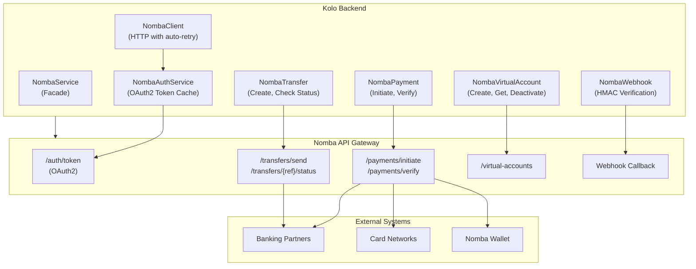
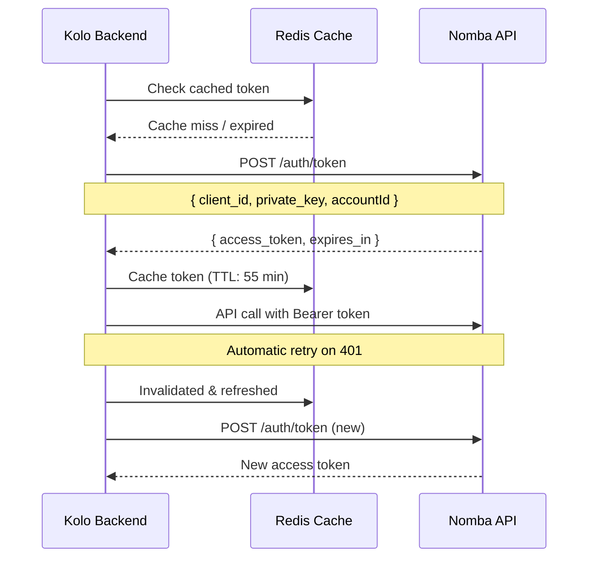
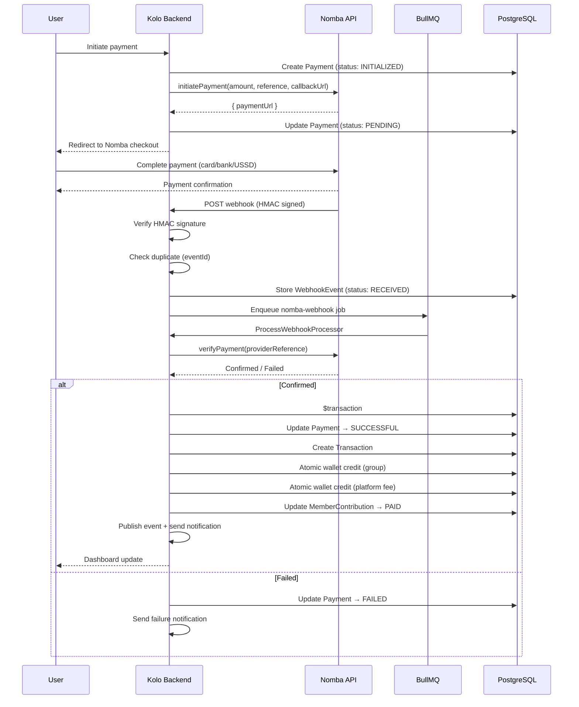
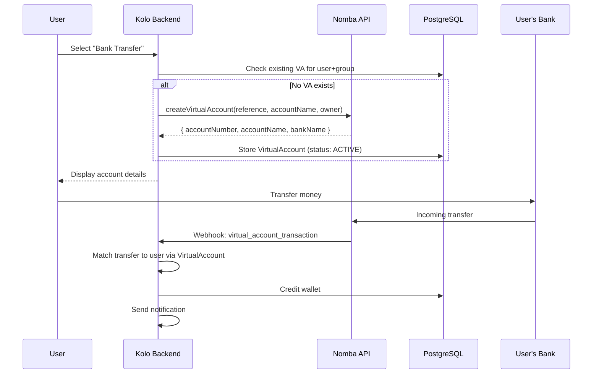
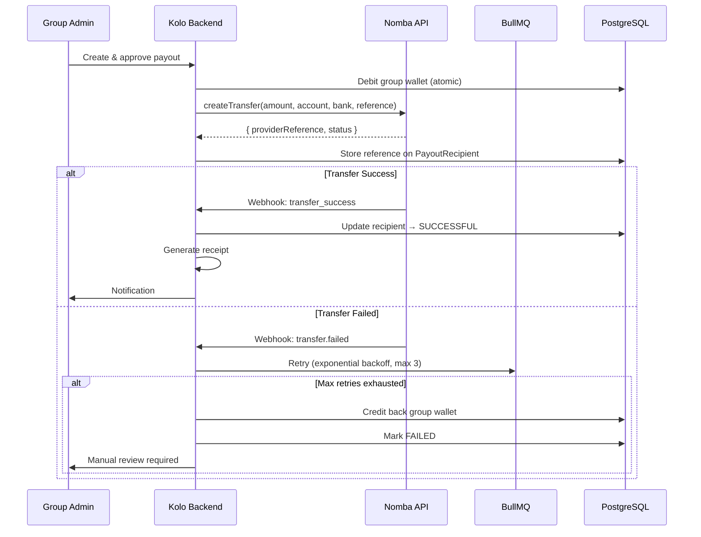
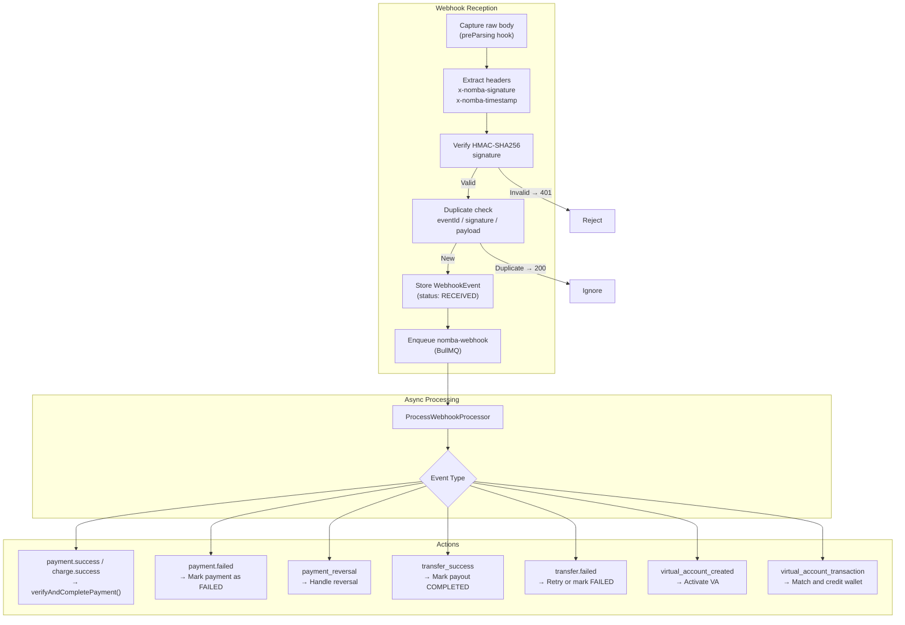
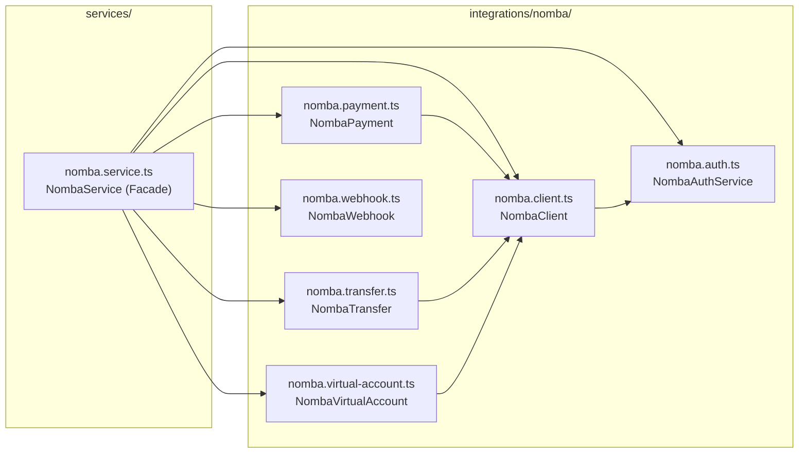

# Nomba Integration

This document explains how Kolo integrates with the Nomba payment gateway — covering authentication, payment flow, virtual accounts, transfers, and webhooks.

---

## Why Nomba?

Nomba is a leading Nigerian payment infrastructure provider that offers:

- **Payment initiation** (card, bank, USSD)
- **Payment verification** (confirm transaction status)
- **Virtual accounts** (dedicated bank account numbers)
- **Transfers** (send money to bank accounts)
- **Webhooks** (real-time payment notifications)

Kolo chose Nomba for its comprehensive API, Nigerian market focus, and reliable webhook system.

---

## Integration Architecture



---

## Authentication

Nomba uses OAuth2 client credentials for API authentication:



- Token cached in Redis with 55-minute TTL
- Auto-refreshes when expired
- Separate credentials for test and live environments

---

## Configuration

```env
NOMBA_ENVIRONMENT=test           # or "live"
NOMBA_PARENT_ACCOUNT_ID=parent_xxx
NOMBA_SUB_ACCOUNT_ID=sub_xxx
NOMBA_TEST_CLIENT_ID=test_xxx
NOMBA_TEST_PRIVATE_KEY=test_key_xxx
NOMBA_LIVE_CLIENT_ID=live_xxx
NOMBA_LIVE_PRIVATE_KEY=live_key_xxx
NOMBA_WEBHOOK_SECRET=whsec_xxx
NOMBA_BASE_URL=https://api.nomba.com/v1
NOMBA_TRANSFER_BASE_URL=https://api.nomba.com/v1
```

---

## Payment Flow



---

## Virtual Accounts

Kolo uses Nomba virtual accounts to receive bank transfers:



---

## Transfers

Kolo uses Nomba transfers for payouts:



---

## Webhook Verification

Every Nomba webhook is verified using HMAC-SHA256:

```typescript
class NombaWebhook {
  verifySignature(payload: string, signature: string, timestamp: string): boolean {
    const expected = crypto
      .createHmac("sha256", this.webhookSecret)
      .update(`${timestamp}.${payload}`)
      .digest("hex");

    // Timing-safe comparison
    return crypto.timingSafeEqual(
      Buffer.from(expected),
      Buffer.from(signature)
    );
  }
}
```

### Webhook Processing Pipeline



---

## Duplicate Detection

Webhook events are deduplicated at multiple levels:

1. **Provider event ID** — Unique constraint on `[provider, eventId]`
2. **Signature replay window** — Same signature within 5 minutes is rejected
3. **Payload content** — Same payment reference and status is rejected

---

## Error Handling & Retry

| Scenario | Behavior |
|---|---|
| API returns 401 | Refresh token, retry request |
| API returns 408/429/5xx | Retry with exponential backoff (max 3 attempts) |
| Network timeout | Retry after 30s |
| Webhook signature invalid | Log security event, return 401 |
| Payment verification failed | Schedule retry via background job |
| Transfer failed (provider) | Retry up to 3 times, then mark as failed |

---

## Integration Files



| File | Class | Purpose |
|---|---|---|
| `integrations/nomba/nomba.client.ts` | `NombaClient` | HTTP client with auto-retry, token injection |
| `integrations/nomba/nomba.auth.ts` | `NombaAuthService` | OAuth2 token acquisition and Redis caching |
| `integrations/nomba/nomba.payment.ts` | `NombaPayment` | Initiate, verify, lookup payments |
| `integrations/nomba/nomba.transfer.ts` | `NombaTransfer` | Create transfer, check status, verify |
| `integrations/nomba/nomba.virtual-account.ts` | `NombaVirtualAccount` | Create, get, list, deactivate VAs |
| `integrations/nomba/nomba.webhook.ts` | `NombaWebhook` | HMAC-SHA256 signature verification |
| `services/nomba.service.ts` | `NombaService` | Orchestration facade for all Nomba operations |
