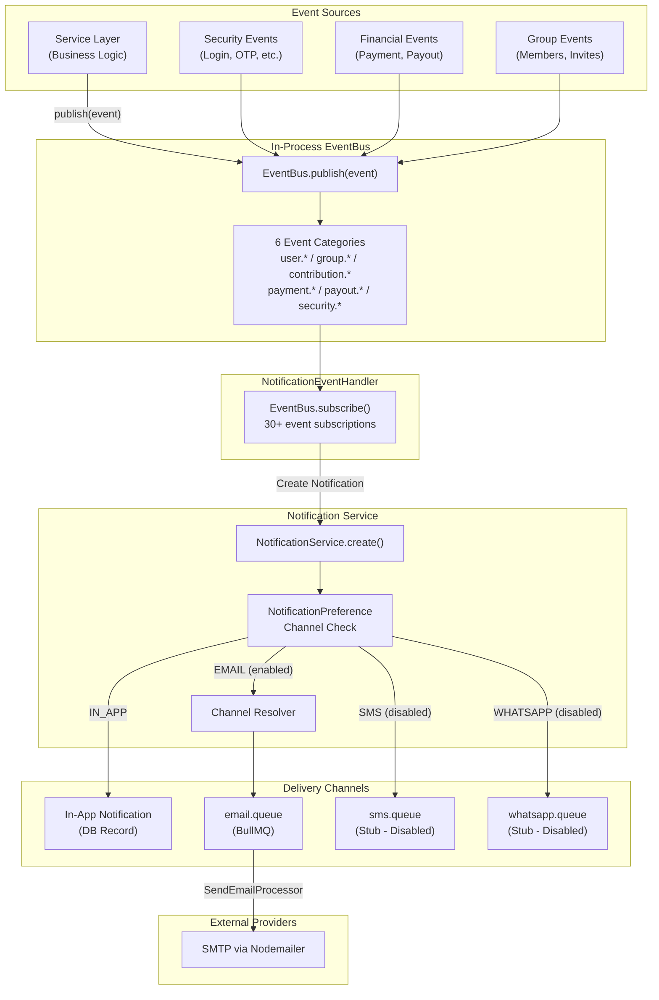
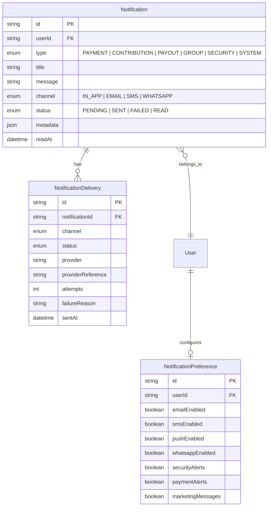

# Notification System

This document describes the notification system in Kolo — covering delivery channels, event triggers, templates, and user preferences.

---

## Architecture



---

## Channel Support

| Channel | Env Flag | Default | Provider | Status |
|---|---|---|---|---|
| In-App | Always enabled | ON | Database record | Active |
| Email | `ENABLE_EMAIL_NOTIFICATIONS` | `true` | Nodemailer + SMTP | Active |
| SMS | `ENABLE_SMS_NOTIFICATIONS` | `false` | Configurable API | Stub (disabled) |
| WhatsApp | `ENABLE_WHATSAPP_NOTIFICATIONS` | `false` | Configurable API | Stub (disabled) |

---

## Database Schema



---

## Event Triggers

### Authentication Events

| Event | Trigger | Channel |
|---|---|---|
| `user.registered` | New account created | Email |
| `user.login_success` | Successful login (new device) | Email |
| `user.login_failed` | Failed login attempt | Email |
| `password.changed` | Password updated | Email |
| `password.reset_requested` | Password reset initiated | Email |
| `email.verified` | OTP verification completed | Email |
| `account.suspended` | Account suspended by admin | Email |

### Group Events

| Event | Trigger | Channel |
|---|---|---|
| `group.created` | New group created | Email |
| `group.updated` | Group settings changed | Email |
| `group.member_invited` | Member invited to join | Email |
| `group.member_joined` | Member accepted invitation | Email |
| `group.member_removed` | Member removed from group | Email |
| `group.admin_changed` | Group admin role changed | Email |

### Contribution Events

| Event | Trigger | Channel |
|---|---|---|
| `contribution.created` | New contribution plan active | Email |
| `contribution.reminder` | Payment due reminder | Email |
| `contribution.received` | Payment received | Email |
| `contribution.completed` | Cycle completed | Email |
| `contribution.overdue` | Payment overdue | Email |
| `contribution.cycle_started` | New cycle begins | Email |

### Payment Events

| Event | Trigger | Channel |
|---|---|---|
| `payment.initialized` | Payment initiated | Email |
| `payment.successful` | Payment confirmed | Email |
| `payment.failed` | Payment failed | Email |
| `payment.reversed` | Payment reversed | Email |
| `payment.refunded` | Payment refunded | Email |

### Payout Events

| Event | Trigger | Channel |
|---|---|---|
| `payout.created` | Payout created | Email |
| `payout.requested` | Approval required | Email |
| `payout.approved` | Payout approved | Email |
| `payout.rejected` | Payout rejected | Email |
| `payout.processing` | Payout processing | Email |
| `payout.completed` | Funds sent | Email |
| `payout.failed` | Transfer failed | Email |

### Security Events

| Event | Trigger | Channel |
|---|---|---|
| `security.suspicious_login` | Suspicious login detected | Email |
| `security.system_alert` | System security issue | Email |
| `security.admin_action` | Admin action on account | Email |

---

## Email Implementation

```mermaid
flowchart LR
    Service["Service Layer"]
    EventBus["EventBus"]
    Handler["NotificationEventHandler"]
    NotifService["NotificationService"]
    ChannelRes["Channel Resolver"]
    EmailQ["email.queue\n(BullMQ)"]
    EmailProcessor["SendEmailProcessor"]
    TemplateSvc["Email Template Service"]
    SMTP["SMTP Provider\n(Nodemailer)"]
    EmailLog["email_logs table"]

    Service --> EventBus
    EventBus --> Handler
    Handler --> NotifService
    NotifService --> ChannelRes
    ChannelRes --> EmailQ
    EmailQ --> EmailProcessor
    EmailProcessor --> TemplateSvc
    TemplateSvc --> SMTP
    SMTP -->|"status"| EmailLog
```



The email system uses:
- **Nodemailer** for SMTP transport
- **Configurable templates** via `EmailTemplateService`
- **Delivery tracking** via `EmailLog` table
- **Retry logic** with configurable max retries (default: 3) and delay (default: 60s)

### Email Templates

The `integrations/email/email-template.service.ts` provides template rendering with dynamic variables. Templates are configured in the database via `PlatformSetting` records.

---

## User Preferences

Users can configure notification preferences per channel and type:

```typescript
interface NotificationPreference {
  emailEnabled: boolean;      // Receive email notifications
  smsEnabled: boolean;        // Receive SMS notifications
  pushEnabled: boolean;       // Receive push notifications
  whatsappEnabled: boolean;   // Receive WhatsApp notifications
  securityAlerts: boolean;    // Security-related notifications
  paymentAlerts: boolean;     // Payment-related notifications
  marketingMessages: boolean; // Marketing communications
}
```

Preferences are stored in the `notification_preferences` table with a unique constraint on `userId`. Default preferences are created when a user registers.

---

## Delivery Tracking

Every notification delivery is tracked in the `notification_deliveries` table:

| Column | Purpose |
|---|---|
| `channel` | Delivery channel used |
| `status` | PENDING, SENT, FAILED, READ |
| `provider` | External provider (e.g., SMTP) |
| `providerReference` | Provider-side reference ID |
| `attempts` | Number of delivery attempts |
| `failureReason` | Error message on failure |
| `sentAt` | Timestamp of successful delivery |
