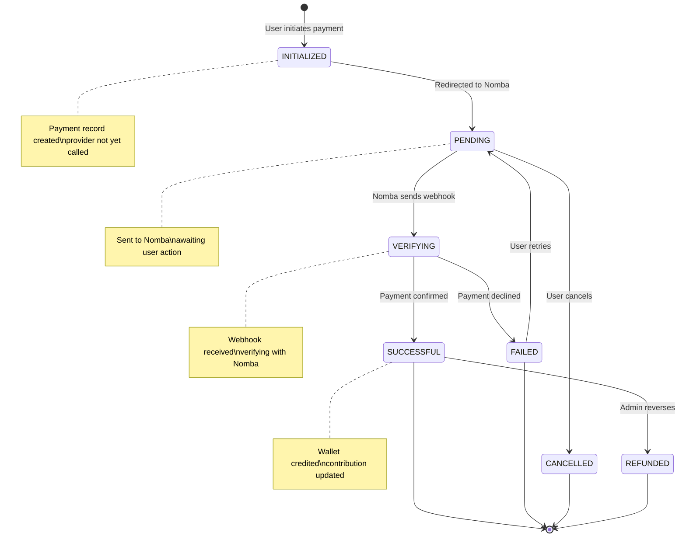
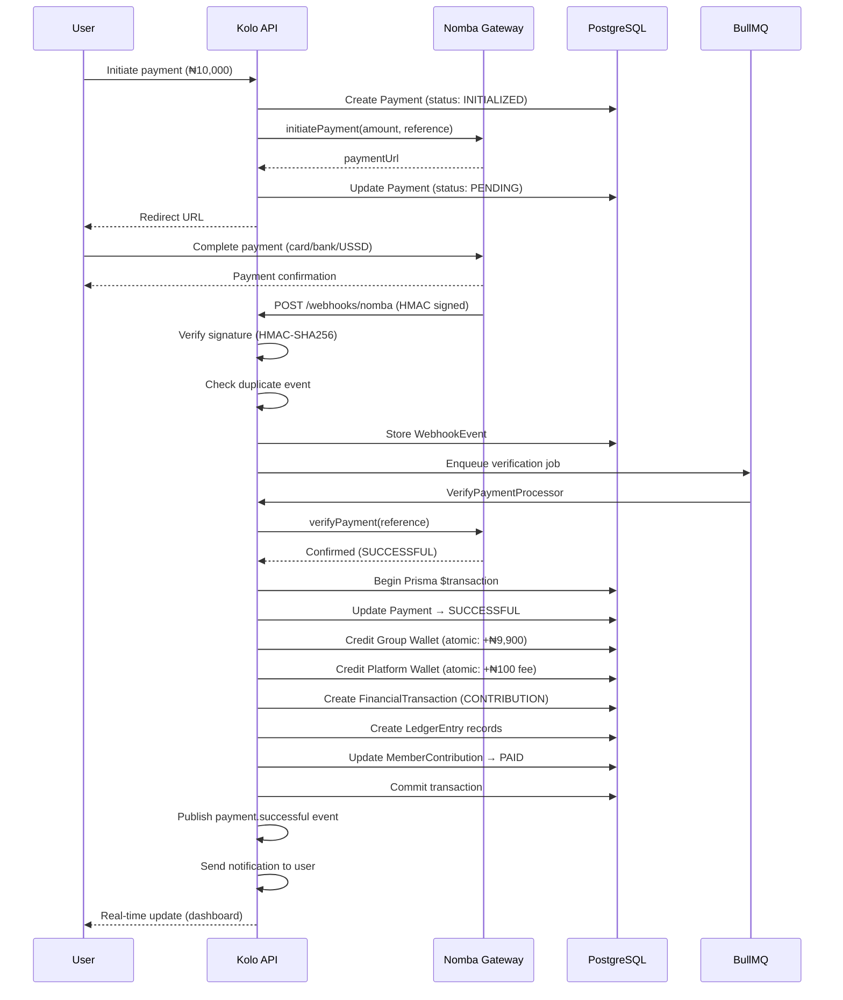
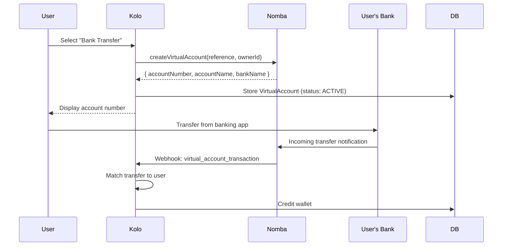
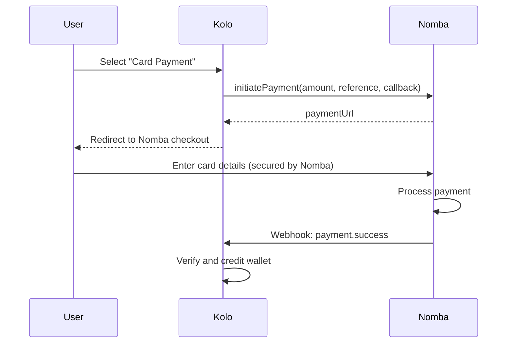
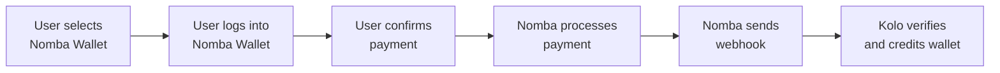
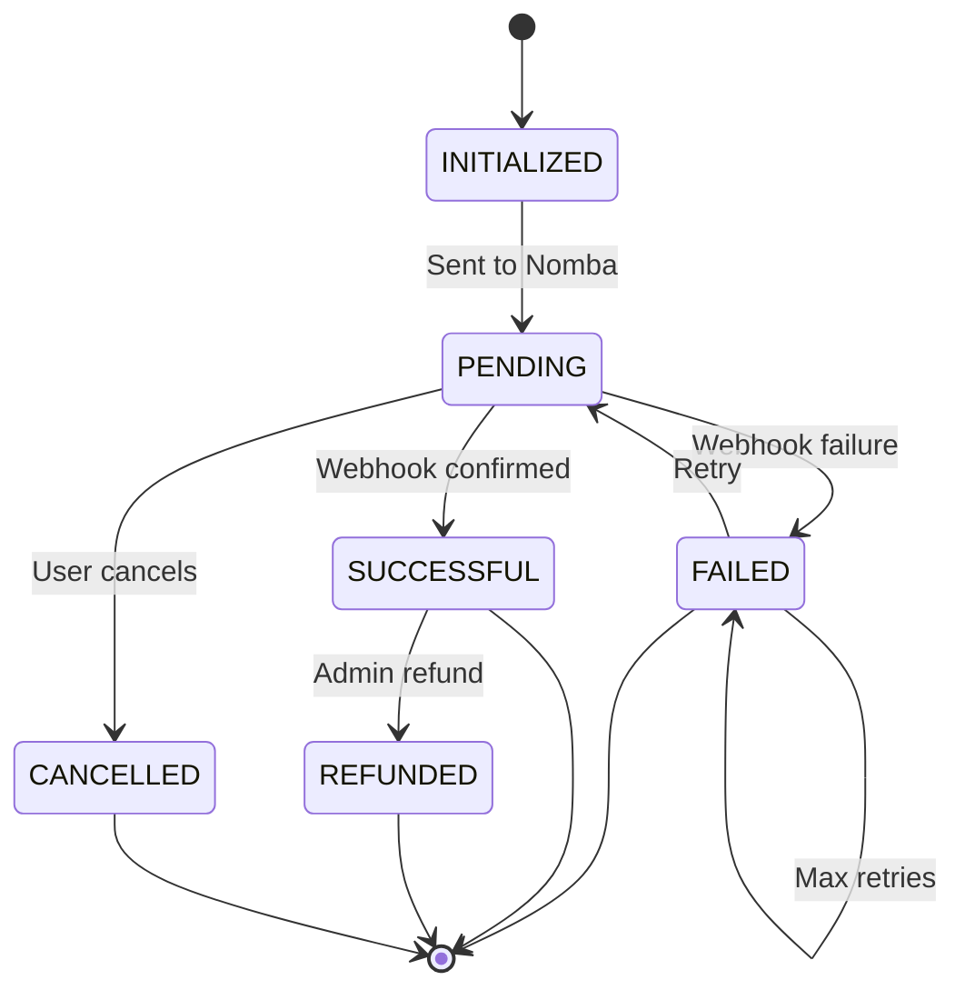

# Payment Flow

This document explains how money moves through the Kolo platform — from member contribution to group wallet credit.

---

## Payment Lifecycle



---

## Complete Money Movement

### Step-by-Step



### Atomic Wallet Operations

All wallet updates use database-level atomic operations to prevent race conditions:

```sql
-- Instead of read-modify-write:
-- SELECT balance FROM wallets WHERE id = 'group-wallet-id'
-- balance = balance + 9900
-- UPDATE wallets SET balance = 9900 WHERE id = 'group-wallet-id'

-- Kolo uses atomic increment:
UPDATE wallets
SET balance = balance + 9900
WHERE id = 'group-wallet-id'
RETURNING balance;
```

### Transactional Integrity

Multiple operations within a payment are wrapped in a Prisma transaction:

```typescript
await prisma.$transaction(async (tx) => {
  // 1. Update payment status
  await tx.payment.update({ where: { id }, data: { status: "SUCCESSFUL" } });

  // 2. Credit group wallet (atomic)
  await tx.wallet.update({
    where: { id: groupWalletId },
    data: { balance: { increment: netAmount } },
  });

  // 3. Credit platform wallet (atomic)
  await tx.wallet.update({
    where: { id: platformWalletId },
    data: { balance: { increment: feeAmount } },
  });

  // 4. Create FinancialTransaction
  await tx.financialTransaction.create({ ... });

  // 5. Create LedgerEntries
  await tx.ledgerEntry.createMany({ data: [...] });

  // 6. Update MemberContribution
  await tx.memberContribution.update({ where: { id }, data: { status: "PAID", paidAmount: amount } });
});
```

---

## Payment Methods

### 1. Bank Transfer (via Virtual Account)



### 2. Card Payment



### 3. Nomba Wallet



---

## Fee Architecture

| Component | Rate | Maximum |
|---|---|---|
| Platform fee | 1% of contribution | ₦2,000 per transaction |
| Nomba processing fee | Varies by method | Nomba's standard rates |

### Fee Calculation

```typescript
class FeeEngine {
  calculateContributionFee(amount: number, currency: string): number {
    if (currency !== "NGN") return 0;
    const fee = Math.round(amount * 0.01); // 1%
    return Math.min(fee, 2000 * 100); // cap at ₦2,000 (in kobo)
  }
}
```

### Fee Examples

| Contribution Amount | Fee | Group Credit | Platform Revenue |
|---|---|---|---|
| ₦5,000 | ₦50 | ₦4,950 | ₦50 |
| ₦10,000 | ₦100 | ₦9,900 | ₦100 |
| ₦50,000 | ₦500 | ₦49,500 | ₦500 |
| ₦500,000 | ₦2,000 (capped) | ₦498,000 | ₦2,000 |

---

## Payment States



| State | Description |
|---|---|
| `INITIALIZED` | Payment record created, not yet sent to provider |
| `PENDING` | Sent to provider, awaiting user action |
| `SUCCESSFUL` | Verified and completed |
| `FAILED` | Payment failed (can be retried) |
| `CANCELLED` | User cancelled before completion |
| `REFUNDED` | Payment was reversed/refunded |

---

## Payment Security

1. **Webhook Verification** — All payment confirmations come through HMAC-signed webhooks, never from the frontend
2. **Duplicate Detection** — Events are deduplicated by provider event ID, signature, and payload
3. **Atomic Operations** — Wallet credits use atomic increments to prevent race conditions
4. **Transaction Integrity** — Multi-step operations wrapped in database transactions
5. **Idempotency** — Payment references are unique, preventing double-processing
6. **Audit Trail** — Every payment state change is logged with full context
