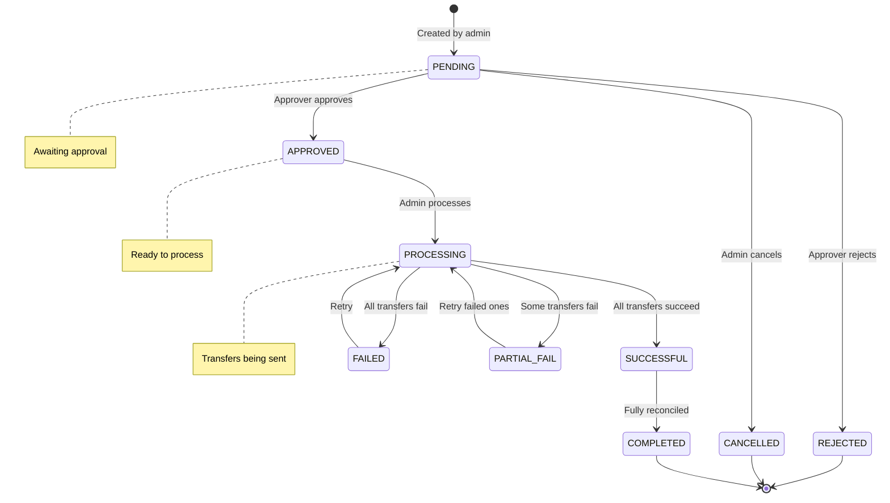
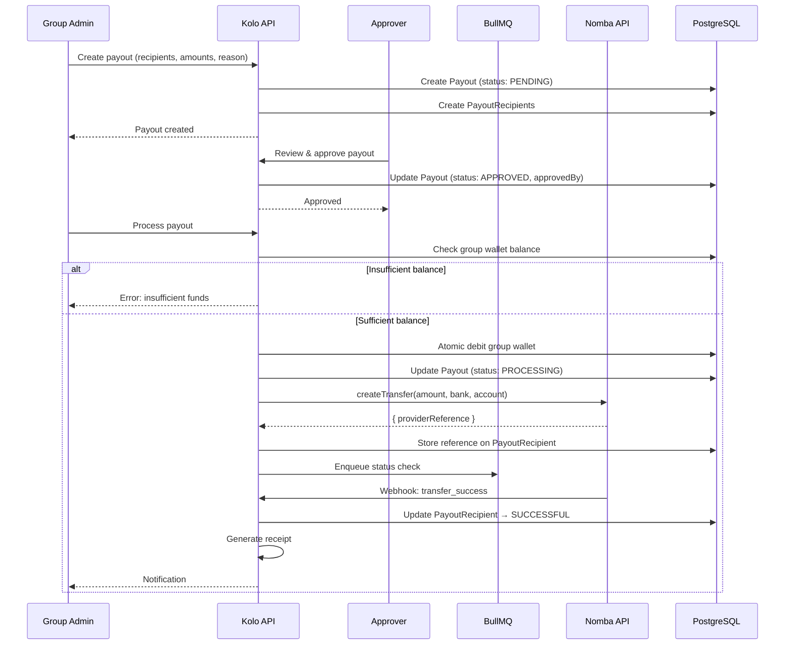
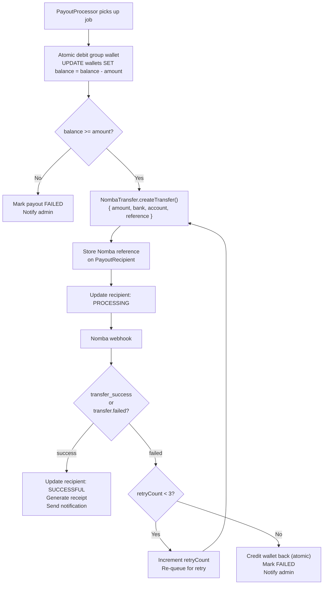
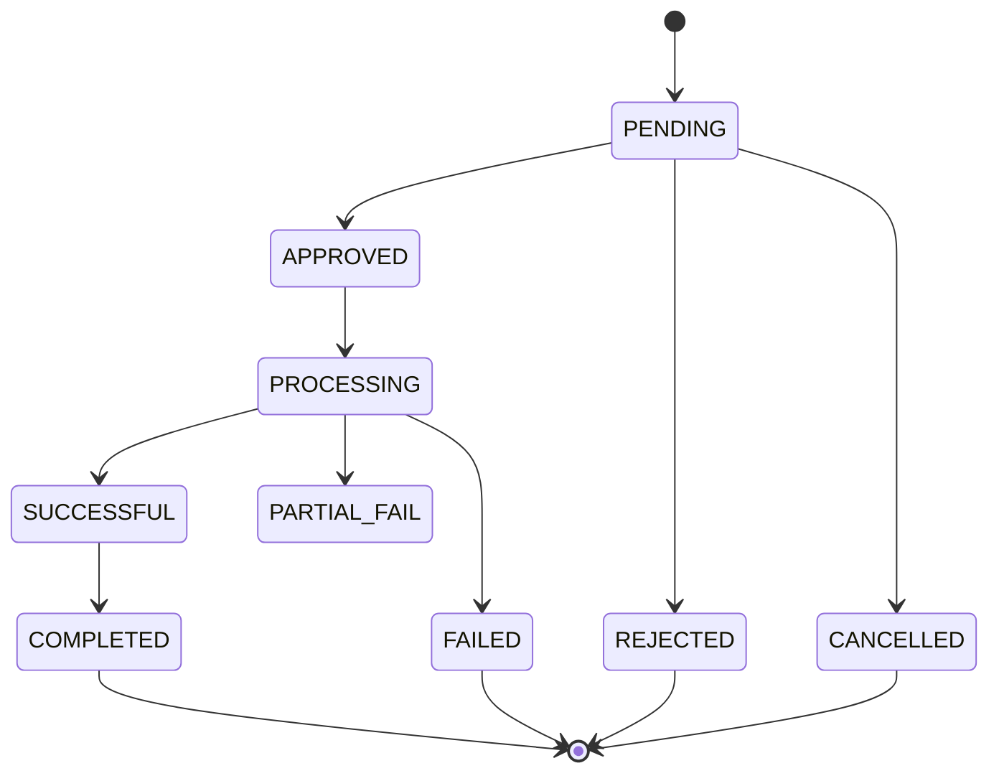

# Payout Flow

This document explains how withdrawals work in Kolo — from initiation and approval to transfer processing and ledger updates.

---

## Payout Lifecycle



---

## Payout Approval Workflow



---

## Money Movement

### Payout Flow Diagram

```
Group Wallet (₦500,000)
        │
        ▼
  Payout Created (₦200,000)
        │
        ├── Recipient 1 (Ada): ₦100,000
        │     └── Nomba Transfer → Ada's Bank Account
        │
        ├── Recipient 2 (Emeka): ₦60,000
        │     └── Nomba Transfer → Emeka's Bank Account
        │
        └── Recipient 3 (Tunde): ₦40,000
              └── Nomba Transfer → Tunde's Bank Account
```

### Ledger Impact

```
Before Payout:
  Group Wallet: ₦500,000

After Payout (₦200,000 total):
  Group Wallet: ₦300,000  (debited ₦200,000)

Ledger Entries:
  LedgerEntry 1:
    Wallet: Group Wallet
    Direction: OUT
    Amount: ₦200,000
    Balance: 500,000 → 300,000
    Description: "Payout to 3 members"

  FinancialTransaction:
    Type: PAYOUT
    Amount: ₦200,000
    Status: SUCCESSFUL
    Source: Group Wallet
    Destination: Various member bank accounts
```

---

## Transfer Processing

### Individual Transfer Flow



### Retry Logic

```
Transfer Failed
    │
    ├── Retry 1: After 60 seconds
    │       │
    │       ├── Success → Done
    │       └── Failure → Retry 2
    │
    ├── Retry 2: After 120 seconds
    │       │
    │       ├── Success → Done
    │       └── Failure → Retry 3
    │
    └── Retry 3: After 240 seconds
            │
            ├── Success → Done
            └── Failure → Mark as FAILED (final)
                          Credit wallet back
                          Notify admin
```

---

## Payout Types

### Manual Payout
- Admin creates payout on-demand
- Selects recipients manually
- One-time distribution

### Rotation Payout
- Automated rotating payout to members
- Each cycle, a different member receives the pot
- Configurable rotation order

### Custom Payout
- Admin-defined distribution rules
- Can specify amounts per recipient
- Supports partial distributions

### Scheduled Payout
- Recurring payout on a schedule
- Frequencies: weekly, monthly, custom interval
- Automatic execution via background job

---

## Payout States



| State | Description |
|---|---|
| `PENDING` | Created, awaiting approval |
| `APPROVED` | Approved, ready to process |
| `PROCESSING` | Transfers being sent |
| `SUCCESSFUL` | All transfers completed successfully |
| `COMPLETED` | Fully processed and reconciled |
| `FAILED` | All transfers failed, funds returned to wallet |
| `REJECTED` | Rejected by approver |
| `CANCELLED` | Cancelled before processing |

---

## Transfer Receipt

After a successful payout, Kolo generates a receipt:

```
KOLO Transfer Receipt
─────────────────────
Receipt: RCP-xxxxxxxx
Date: July 15, 2026
Group: Lagos Savings Circle

Transfer Details:
  Recipient: Ada Okafor
  Amount: ₦100,000
  Bank: Access Bank
  Account: ****1234
  Reference: KOLO-POUT-xxxxx
  Status: Successful

Powered by Nomba
```

---

## Payout Schedules

### Schedule Configuration

```json
{
  "type": "ROTATION",
  "frequency": "MONTHLY",
  "amount": 500000,
  "dayOfMonth": 15,
  "status": "ACTIVE"
}
```

### Schedule Execution

```
Cron job runs daily
        │
Check schedules with nextExecutionDate <= today
        │
For each schedule:
  ├── Create payout
  ├── Add recipients (rotation order)
  ├── Update nextExecutionDate
  └── Process automatically
```

---

## Payout Security

1. **Group Admin Check** — Only GROUP_OWNER/GROUP_ADMIN can create and process payouts
2. **Wallet Balance Check** — Payout creation validates sufficient balance
3. **Atomic Debit** — Group wallet is debited atomically; credited back on failure
4. **Duplicate Prevention** — Payout reference prevents double-processing
5. **Approval Workflow** — Multi-step approval for large payouts
6. **Recipient Account Verification** — Only verified accounts can receive payouts
7. **Audit Trail** — All payout actions logged with actor identity
