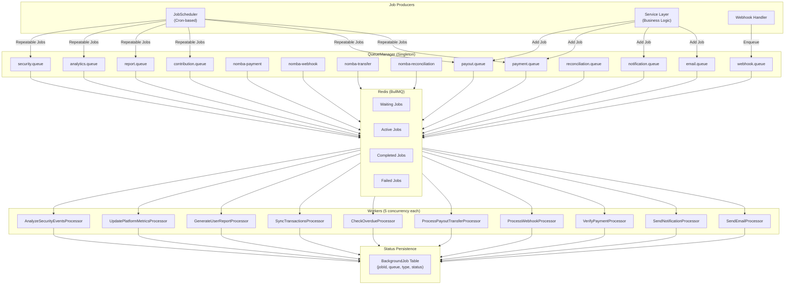
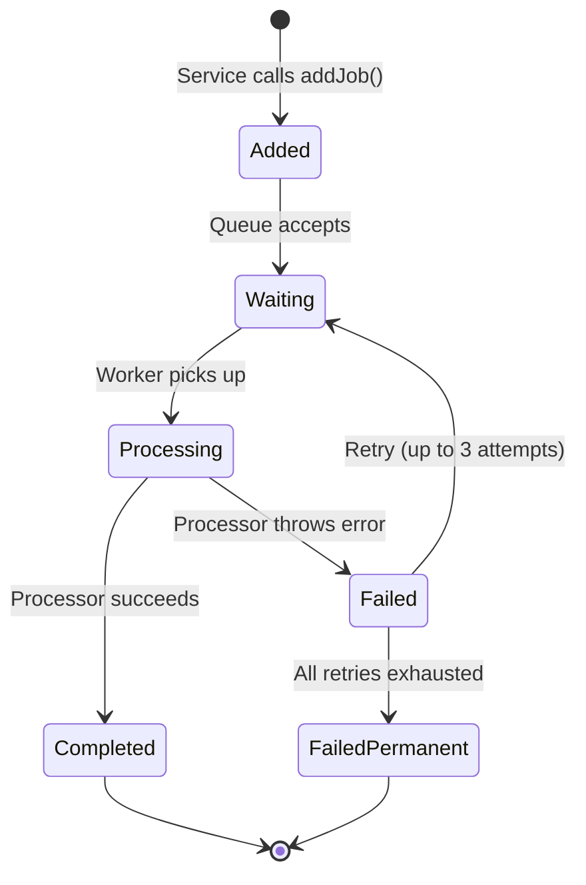

# Queue System

This document describes the background job system in Kolo — built on **BullMQ** with **Redis** for reliable asynchronous processing.

---

## Architecture



---

## Queue Definitions

### Standard Queues

| Queue Name | Processor | Purpose |
|---|---|---|
| `email.queue` | `SendEmailProcessor` | Render templates, send via SMTP, track delivery |
| `notification.queue` | `SendNotificationProcessor` | Multi-channel dispatch (in-app + email + SMS/WhatsApp) |
| `payment.queue` | `VerifyPaymentProcessor` | Re-check pending/failed payment status |
| `webhook.queue` | `ProcessWebhookProcessor` | Parse and route Nomba webhook events |
| `contribution.queue` | `CheckOverdueProcessor` | Mark overdue contributions, send reminders |
| `payout.queue` | `ProcessPayoutTransferProcessor` | Initiate Nomba transfers for payouts |
| `reconciliation.queue` | `SyncTransactionsProcessor` | Sync provider transactions with internal records |
| `report.queue` | `GenerateUserReportProcessor` | Generate daily/weekly reports |
| `analytics.queue` | `UpdatePlatformMetricsProcessor` | Update platform analytics and aggregations |
| `security.queue` | `AnalyzeSecurityEventsProcessor` | Monitor security events, cleanup sessions |

### Nomba-Specific Queues

| Queue Name | Purpose |
|---|---|
| `nomba-auth` | Nomba OAuth2 token management |
| `nomba-payment` | Payment verification against Nomba |
| `nomba-webhook` | Nomba webhook processing |
| `nomba-transfer` | Transfer processing via Nomba |
| `nomba-reconciliation` | Nomba transaction reconciliation |

### Retry & Specialized Queues

| Queue Name | Processor | Purpose |
|---|---|---|
| `payment.queue.retry` | `RetryFailedPaymentProcessor` | Retry failed payment verifications |
| `payout.queue.retry` | `RetryFailedTransferProcessor` | Retry failed transfers (exponential backoff) |
| `payout.queue.status` | `CheckTransferStatusProcessor` | Check pending transfer statuses |
| `payout.queue.receipt` | `GeneratePayoutReceiptProcessor` | Generate payout receipts |
| `contribution.queue.reminder` | `SendReminderProcessor` | Send payment reminders |
| `contribution.queue.generate` | `GenerateCyclesProcessor` | Auto-generate contribution cycles |
| `reconciliation.queue.match` | `MatchTransactionsProcessor` | Match provider vs internal records |
| `reconciliation.queue.report` | `GenerateReconciliationReportProcessor` | Generate reconciliation reports |
| `report.queue.user` | `GenerateUserReportProcessor` | User-specific reports |
| `report.queue.group` | `GenerateGroupReportProcessor` | Group-specific reports |
| `report.queue.transaction` | `GenerateTransactionReportProcessor` | Transaction reports |
| `report.queue.revenue` | `GenerateRevenueReportProcessor` | Revenue reports |
| `analytics.queue.daily` | `CalculateDailyStatsProcessor` | Daily statistics calculation |
| `security.queue.cleanup` | `CleanupExpiredSessionsProcessor` | Remove expired sessions |

---

## Job Lifecycle



### Default Job Options

| Option | Value |
|---|---|
| Max attempts | 3 |
| Backoff type | Exponential |
| Backoff delay | 5,000ms (base) |
| Timeout | 30,000ms |
| Remove on complete | After 24 hours or 100 jobs |
| Remove on fail | After 7 days or 50 jobs |

---

## Scheduled (Cron) Jobs

| Job | Queue | Cron | Purpose |
|---|---|---|---|
| `UPDATE_PLATFORM_METRICS` | `analytics.queue` | Daily at midnight | Refresh platform metrics |
| `CHECK_OVERDUE_CONTRIBUTIONS` | `contribution.queue` | Daily at midnight | Mark overdue contributions |
| `VERIFY_PAYMENT` | `payment.queue` | Every hour | Re-check pending payments |
| `CHECK_PAYOUT_STATUS` | `payout.queue` | Every hour | Check pending transfer statuses |
| `CLEANUP_EXPIRED_SESSIONS` | `security.queue` | Daily at midnight | Remove expired sessions |
| `GENERATE_REVENUE_REPORT` | `report.queue` | Daily at 6 AM | Generate revenue report |

---

## Worker Configuration

```typescript
const worker = new Worker(
  queueName,
  async (job) => {
    // Processing logic
  },
  {
    connection: redis,      // IORedis connection
    prefix: "KOLO",         // Queue prefix
    concurrency: 5,         // Max 5 concurrent jobs
  }
);
```

| Property | Value |
|---|---|
| Connection | IORedis (same instance as QueueManager) |
| Prefix | `KOLO` (configurable via `QUEUE_PREFIX` env var) |
| Concurrency | 5 per worker |
| Retry on fail | Built into defaultJobOptions |

---

## Redis Connection

```typescript
const redisOpts = {
  host: env.REDIS_HOST,       // default: localhost
  port: env.REDIS_PORT,       // default: 6379
  db: env.REDIS_DB,           // default: 0
  password: env.REDIS_PASSWORD,
  maxRetriesPerRequest: null,
  enableReadyCheck: false,
};
```

Redis is used for:
1. **BullMQ Queue Storage** — Job persistence and state management
2. **Nomba Token Cache** — OAuth2 access tokens cached with 55-minute TTL
3. **Future use** — Rate limiting store, session cache

---

## Monitoring

The `BackgroundJob` table in PostgreSQL mirrors BullMQ job status for admin visibility:

| Column | Description |
|---|---|
| `jobId` | BullMQ job ID |
| `queue` | Queue name |
| `type` | Job type/name |
| `status` | WAITING, PROCESSING, COMPLETED, FAILED |
| `progress` | Percentage complete (0-100) |
| `error` | Error message on failure |
| `payload` | JSON job data |

Admin endpoints provide queue statistics (waiting, active, completed, failed counts) and the ability to retry failed jobs.
