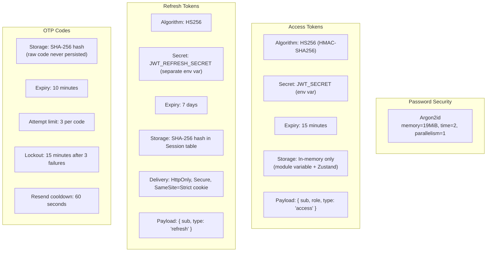
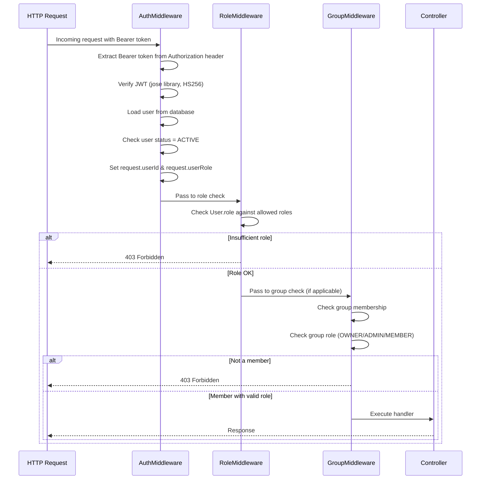
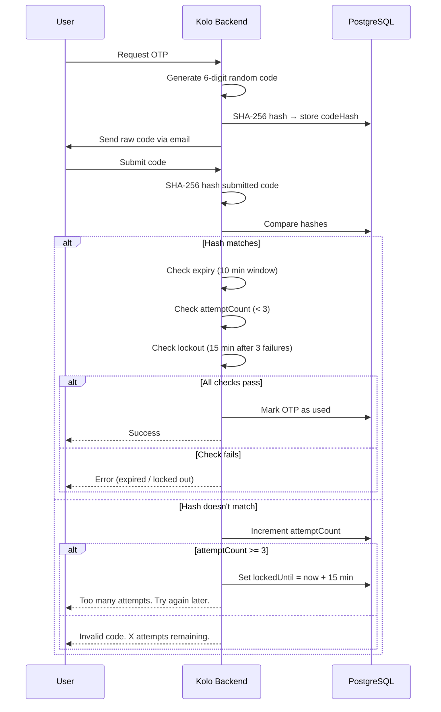
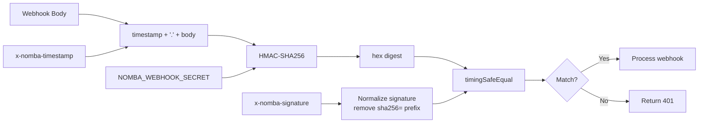

# Security Architecture

This document describes the security architecture of Kolo — covering authentication, authorization, encryption, rate limiting, webhook verification, audit logging, and more.

---

## Security Layers

```mermaid
flowchart TB
    subgraph L1["Layer 1: Transport Security"]
        TLS["HTTPS (TLS 1.3)"]
        Helmet["Helmet HTTP Headers\nCSP, HSTS, X-Frame-Options"]
        CORS["CORS\nExplicit origin allowlist\n(no wildcard in production)"]
    end

    subgraph L2["Layer 2: Request Security"]
        RateLimit["Global rate limiting (100 req/min)\nPer-route auth limits"]
        Validation["Zod input validation\n(all endpoints)"]
        BodyLimit["Request body size limits (1MB)"]
    end

    subgraph L3["Layer 3: Authentication"]
        JWT["JWT access tokens\n(15 min, in-memory only)"]
        Refresh["Refresh tokens\n(HttpOnly Secure cookie, 7 day)"]
        Argon2["Argon2 password hashing\n(memory=19MiB, time=2)"]
        OriginCheck["Origin/Referer validation\non refresh/logout"]
    end

    subgraph L4["Layer 4: Device Verification"]
        Fingerprint["Device fingerprinting\nSHA-256(UA + IP)"]
        OTPChallenge["Unknown device → OTP challenge\nvia email"]
        SessionTrack["Known device marked\nvia session tracking"]
    end

    subgraph L5["Layer 5: Authorization"]
        RoleCheck["Role-based access\nSUPER_ADMIN / GROUP_ADMIN / MEMBER"]
        GroupRole["Group-level role checks\nOWNER / ADMIN / MEMBER"]
        WalletCheck["Wallet ownership checks"]
        ResourceAuth["Resource-level authorization\nin service layer"]
    end

    subgraph L6["Layer 6: Financial Integrity"]
        AtomicOps["Atomic wallet operations\n(balance = balance ± amount)"]
        HMAC["Webhook HMAC-SHA256 verification"]
        DoubleEntry["Double-entry ledger\n(LedgerEntry table)"]
        PrismaTx["Prisma transactions\nfor multi-step operations"]
        Dedup["Duplicate webhook detection\n(provider + eventId unique)"]
    end

    subgraph L7["Layer 7: Audit & Monitoring"]
        AuditLog["Audit logging\nfor all sensitive operations"]
        StructuredLog["Structured JSON logging\n(Pino)"]
        SecurityEvents["Security event monitoring"]
        JobTracking["Background job tracking\n(BackgroundJob table)"]
    end

    subgraph L8["Layer 8: Secrets Management"]
        EnvVars["All credentials from\nenvironment variables"]
        NoHardcode["Never hardcode secrets\nin code"]
        SeparateJWT["Separate JWT secrets\n(access vs refresh)"]
        CookieSecret["Cookie secret independent\nfrom JWT secret"]
    end

    L1 --> L2 --> L3 --> L4 --> L5 --> L6 --> L7 --> L8
```



---

## Authentication Architecture



### JWT Token Verification

```typescript
class JwtUtil {
  static async verifyAccessToken(token: string): Promise<JwtPayload> {
    const { payload } = await jwtVerify(
      token,
      new TextEncoder().encode(env.JWT_SECRET),
      { algorithms: ["HS256"] }
    );

    if (payload.type !== "access") {
      throw new AuthError("Invalid token type");
    }

    return payload;
  }
}
```

---

## Authorization Flow



### AuthMiddleware

```typescript
async authenticate(request, reply) {
  const token = extractBearerToken(request.headers.authorization);
  const payload = await JwtUtil.verifyAccessToken(token);
  const user = await this.userRepository.findById(payload.sub);

  if (!user) throw new AuthError("User not found");
  if (user.status !== "ACTIVE") throw new AuthError("Account is not active");

  request.userId = user.id;
  request.userRole = user.role;
}
```

### RoleMiddleware

```typescript
class RoleMiddleware {
  constructor(private allowedRoles: Role[]) {}

  async authorize(request, reply) {
    if (!this.allowedRoles.includes(request.userRole)) {
      throw new ForbiddenError("Insufficient permissions");
    }
  }
}
```

---

## Rate Limiting

| Endpoint Group | Limit | Window |
|---|---|---|
| Global | 100 requests | 1 minute |
| Auth: Register | 3 requests | 15 minutes |
| Auth: Login | 5 requests | 1 minute |
| Auth: Refresh | 10 requests | 1 minute |
| Auth: Verify OTP | 5 requests | 5 minutes |
| Auth: Resend OTP | 3 requests | 5 minutes |
| Admin: Reads | 60 requests | 1 minute |
| Admin: Mutations | 20 requests | 1 minute |

Rate limiting is enforced by `@fastify/rate-limit` plugin with configurable per-route limits.

---

## OTP Security

### OTP Flow



### Attempt Tracking

```typescript
async verify(userId: string, code: string, type: string): Promise<boolean> {
  const codeHash = crypto.createHash("sha256").update(code).digest("hex");
  const otp = await this.db.otpCode.findFirst({
    where: { userId, type, codeHash, used: false, expiresAt: { gte: new Date() } },
  });

  if (!otp) {
    // Track failed attempt
    await this.db.otpCode.updateMany({
      where: { userId, type, used: false },
      data: {
        attemptCount: { increment: 1 },
        lockedUntil: attemptCount >= 2 ? DateUtil.addMinutes(new Date(), 15) : undefined,
      },
    });
    return false;
  }

  return true; // Success
}
```

---

## Webhook Security

### HMAC Signature Verification



```typescript
class NombaWebhook {
  verifySignature(payload: string, signature: string, timestamp: string): boolean {
    const expected = crypto
      .createHmac("sha256", this.webhookSecret)
      .update(`${timestamp}.${payload}`)
      .digest("hex");

    return crypto.timingSafeEqual(
      Buffer.from(expected),
      Buffer.from(signature)
    );
  }
}
```

### Duplicate Detection
- By provider event ID (unique constraint)
- By signature within 5-minute replay window
- By payload content matching

---

## Cookie Security

```typescript
function setRefreshCookie(reply: FastifyReply, token: string): void {
  reply.setCookie("refreshToken", token, {
    httpOnly: true,
    secure: env.isProduction,
    sameSite: "strict",
    path: "/api/v1/auth",
    maxAge: 7 * 24 * 60 * 60, // 7 days
    domain: env.COOKIE_DOMAIN,
  });
}
```

---

## CORS Configuration

```typescript
const allowedOrigins = env.isDevelopment
  ? ["http://localhost:5173", "http://localhost:5174"]
  : env.CORS_ORIGIN.split(",").filter(o => o.trim() !== "*");

app.register(fastifyCors, {
  origin: allowedOrigins,
  credentials: true,
  methods: ["GET", "POST", "PATCH", "DELETE"],
  allowedHeaders: ["Content-Type", "Authorization"],
});
```

---

## Security Headers

All backend responses include:

```http
Content-Security-Policy: default-src 'self'; script-src 'self'; ...
X-Content-Type-Options: nosniff
X-Frame-Options: DENY
Referrer-Policy: strict-origin-when-cross-origin
Strict-Transport-Security: max-age=31536000; includeSubDomains
Permissions-Policy: geolocation=(), microphone=(), camera=()
```

---

## Audit Logging

Every sensitive operation is logged:

| Event | Logged Data |
|---|---|
| Login success/failure | userId, IP, user-agent, reason |
| Registration | userId, email |
| Logout | userId |
| Payment created/verified | paymentId, amount, status |
| Payout created/approved/processed | payoutId, amount, actor |
| Wallet transfer | walletId, amount, source/dest |
| Group created/updated | groupId, actor |
| Member added/removed | groupId, memberId, actor |
| Admin action | actor, action, resource |

---

## Redacted Logging

Sensitive fields are automatically redacted from logs:

```typescript
const SENSITIVE_KEYS = new Set([
  "password", "passwordHash", "token", "accessToken", "refreshToken",
  "secret", "apiKey", "apiSecret", "authorization", "cookie",
  "verificationCode", "otp", "code", "pin", "bankAccount",
]);
```

---

## Dependency Security

- `npm audit --omit=dev` reports **0 vulnerabilities**
- Dependencies are pinned to specific versions
- Prisma client is regenerated on install
- No deprecated or unmaintained packages

---

## Security Checklist

- [x] Passwords hashed with Argon2
- [x] Access tokens expire after 15 minutes
- [x] Refresh tokens expire after 7 days
- [x] No tokens stored in localStorage
- [x] Refresh tokens in HttpOnly cookies
- [x] Refresh tokens SHA-256 hashed in database
- [x] Unknown device OTP challenge
- [x] OTP attempt lockout (3 strikes, 15 min)
- [x] OTP resend cooldown (60 seconds)
- [x] Rate limiting on all auth endpoints
- [x] Global rate limiting (100 req/min)
- [x] CORS with explicit origins
- [x] Helmet security headers
- [x] Origin/Referer validation on refresh
- [x] Input validation with Zod
- [x] Atomic wallet operations
- [x] Webhook HMAC verification
- [x] Double-entry accounting
- [x] Audit logging
- [x] Sensitive data redacted from logs
- [x] No secrets hardcoded in code
- [x] Separate secrets for access and refresh tokens
- [x] Cookie secret independent from JWT secret
- [x] 0 npm audit vulnerabilities
