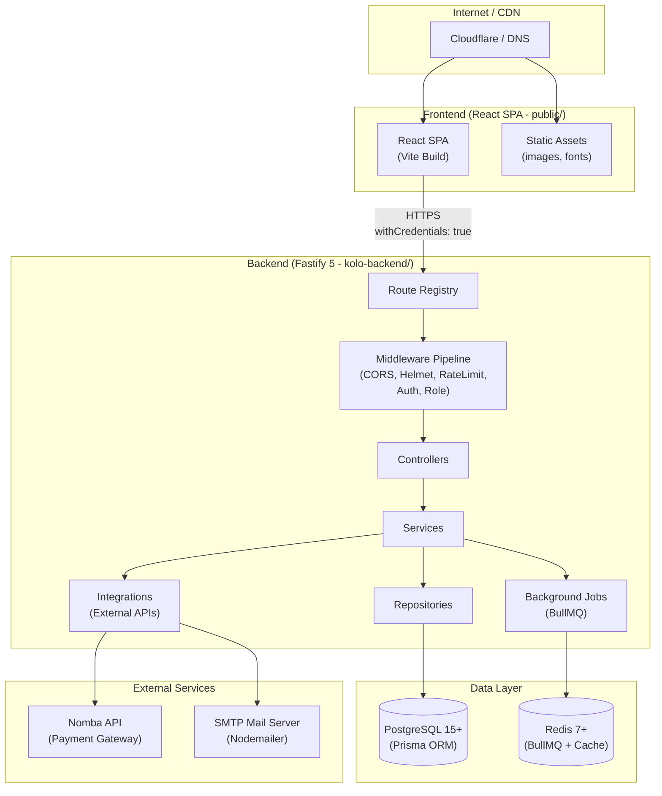
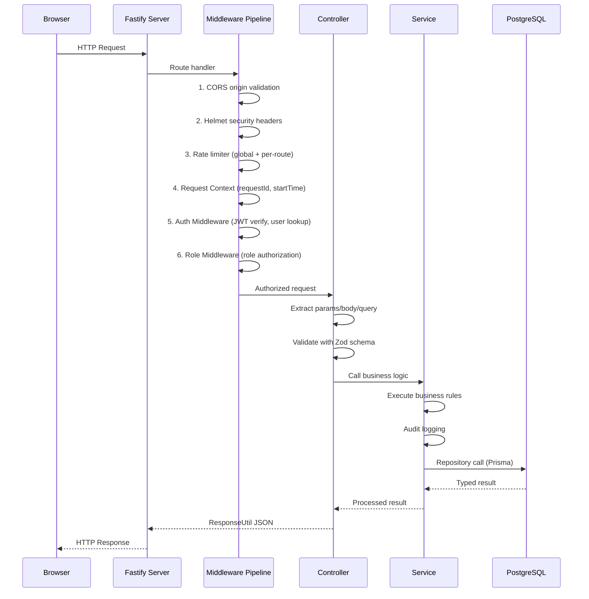

# System Architecture

This document describes the overall architecture of Kolo — from the frontend React SPA through the backend Fastify API to the database and external services.

---

## High-Level Architecture Diagram



---

## Request Lifecycle



---

## Layer Separation

```
┌──────────────────────────────────────────────────────┐
│                    ROUTES                             │
│  Define endpoints, attach middleware, bind handlers  │
├──────────────────────────────────────────────────────┤
│                  MIDDLEWARE                           │
│  Auth, Role, Group access, Rate limit, Error handler │
├──────────────────────────────────────────────────────┤
│                 CONTROLLERS                           │
│  Extract request data, validate, call service        │
├──────────────────────────────────────────────────────┤
│                   SERVICES                            │
│  Business logic, orchestration, validation           │
├──────────────────────────────────────────────────────┤
│                REPOSITORIES                           │
│  Database access via Prisma                          │
├──────────────────────────────────────────────────────┤
│                   DATABASE                            │
│  PostgreSQL + Prisma ORM                             │
└──────────────────────────────────────────────────────┘
```

---

## Key Architectural Decisions

### 1. Clean Architecture (Ansofra Pattern)

Strict layer separation ensures:
- Controllers never access databases directly
- Services contain all business logic
- Repositories have no business rules
- Routes only handle HTTP routing

### 2. In-Memory Access Tokens

Access tokens are stored only in JavaScript memory (module-level variable in the API client + Zustand store). On page reload, `initAuth()` silently refreshes via the HttpOnly refresh cookie.

### 3. Webhook-Driven Payment Verification

Payment status is never trusted from the frontend. The flow is:
```
Frontend → Initiate Payment → Nomba Gateway
                                    ↓
Nomba sends webhook → Server verifies HMAC → Dedup → Process Payment
                                    ↓
                            Update DB, Credit Wallet, Notify User
```

### 4. Double-Entry Accounting

Every financial transaction records equal credits and debits:
```
Member Payment of ₦10,000:
  Debit:  Platform (fee account)      ₦100 (fee)
  Credit: Group Wallet                ₦9,900
  Debit:  Member (payment account)    ₦10,000
```

### 5. Background Job Queue

Heavy operations are processed asynchronously via BullMQ:
- Payment verification
- Email delivery
- Payout processing
- Report generation
- Analytics updates
- Reconciliation

### 6. Event-Driven Notifications

The in-process EventBus decouples business logic from notification delivery:
```
Service → EventBus.publish(event) → EventHandler → NotificationService
```

---

## Technology Stack

| Layer | Technology | Purpose |
|---|---|---|
| **Frontend Framework** | React 19 + TypeScript | UI rendering |
| **Build Tool** | Vite 8 | Fast dev/build |
| **Styling** | Tailwind CSS 4 + Radix UI | Design system |
| **State (Server)** | TanStack Query 5 | API caching |
| **State (Client)** | Zustand 5 | Auth, theme, UI |
| **Backend Framework** | Fastify 5 | HTTP server |
| **ORM** | Prisma 7 | Database access |
| **Database** | PostgreSQL | Primary data store |
| **Queue** | BullMQ + Redis | Async jobs |
| **Auth** | JWT (jose) + Argon2 | Authentication |
| **Payments** | Nomba API | Payment processing |
| **Email** | Nodemailer + SMTP | Notifications |
| **Logging** | Pino | Structured JSON logs |
| **Validation** | Zod 4 | Request/response validation |
| **HTTP Client** | Axios | API communication |

---

## Security Architecture

```mermaid
flowchart LR
    L1["1. Transport Security\nHTTPS, Helmet headers"]
    L2["2. Rate Limiting\nglobal + per-route"]
    L3["3. CORS\nexplicit origins"]
    L4["4. Input Validation\nZod schemas"]
    L5["5. Authentication\nJWT access + HttpOnly cookie"]
    L6["6. Authorization\nRole + Group membership"]
    L7["7. Device Verification\nOTP challenge"]
    L8["8. Financial Integrity\natomic ops, webhook HMAC"]
    L9["9. Audit Logging\nall sensitive operations"]
    L10["10. Secrets Management\nenv vars only"]

    L1 --> L2 --> L3 --> L4 --> L5 --> L6 --> L7 --> L8 --> L9 --> L10
```


