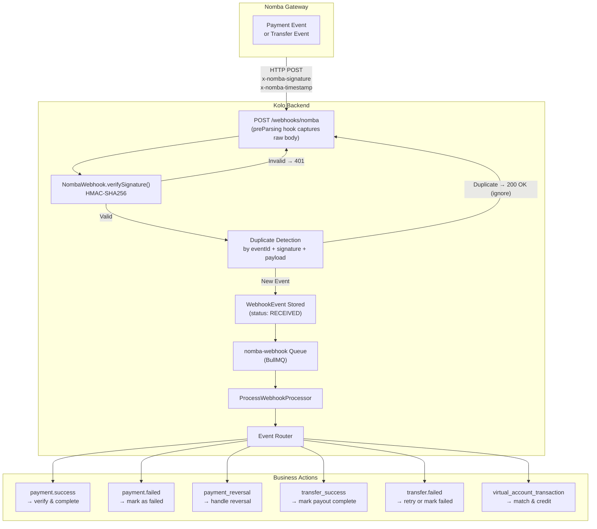
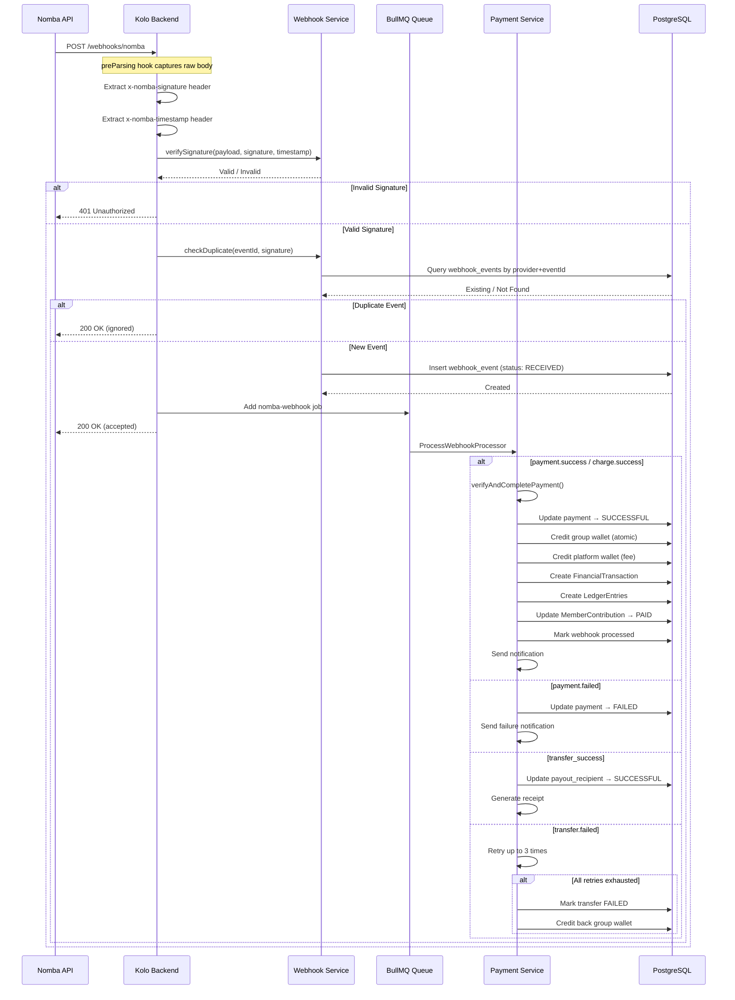
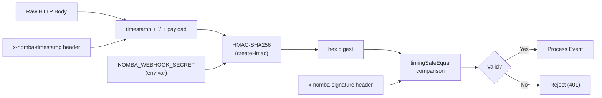

# Webhook Flow

This document describes how Kolo receives, validates, and processes webhook events from external providers — primarily the Nomba payment gateway.

---

## Webhook Processing Pipeline



---

## Sequence Diagram



---

## Signature Verification



Key properties of the webhook verification:
- **HMAC-SHA256** with the webhook secret
- **Timing-safe comparison** prevents timing attacks
- **Timestamp validation** with 5-minute tolerance window prevents replay attacks
- **Normalized signature** handles `sha256=` prefix if present

---

## Duplicate Detection

Webhook events are deduplicated at three levels:

| Level | Mechanism |
|---|---|
| **Provider Event ID** | Unique constraint on `[provider, eventId]` in `webhook_events` table |
| **Signature Replay** | Same signature within 5-minute timestamp window is rejected |
| **Payload Content** | Same payment reference and status combination is rejected |

---

## Webhook Event Model

```prisma
model WebhookEvent {
  id          String    @id @default(uuid())
  provider    String    @default("nomba")
  eventId     String?
  eventType   String
  payload     Json
  signature   String?
  status      String    @default("PENDING")
  processed   Boolean   @default(false)
  processedAt DateTime?
  createdAt   DateTime  @default(now())

  @@unique([provider, eventId])
  @@map("webhook_events")
}
```

---

## Error Handling

| Scenario | Response | Action |
|---|---|---|
| Missing signature header | 401 | Log security event |
| Invalid HMAC signature | 401 | Log security event |
| Expired timestamp (>5 min) | 401 | Log security event |
| Duplicate eventId | 200 OK | Ignore (idempotent) |
| Processing failure | 200 OK (accepted) | Retry via queue |
| Queue processing exhausted | — | Manual review required |
